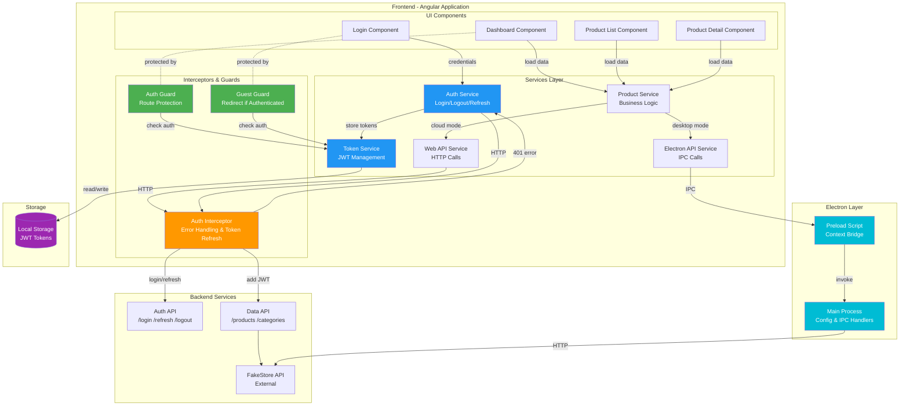
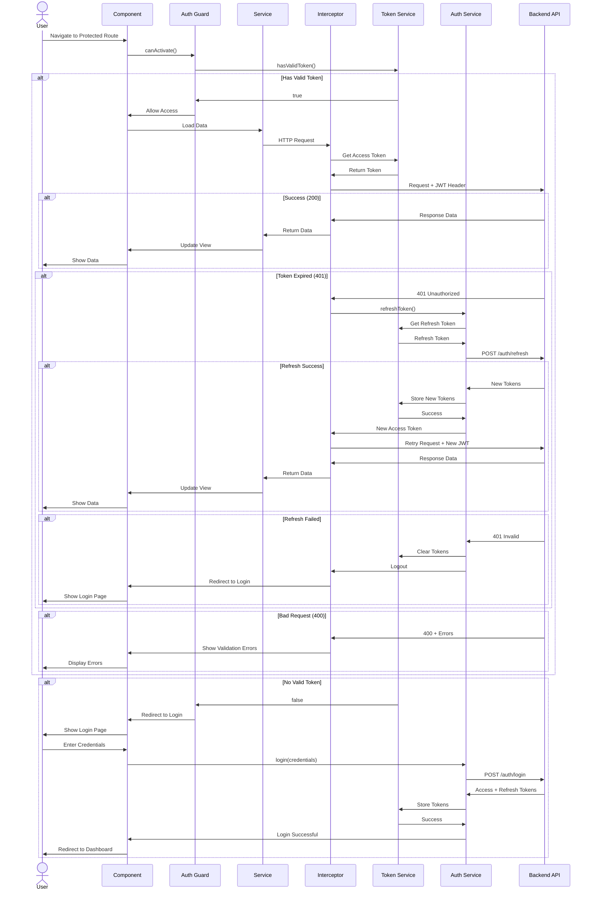
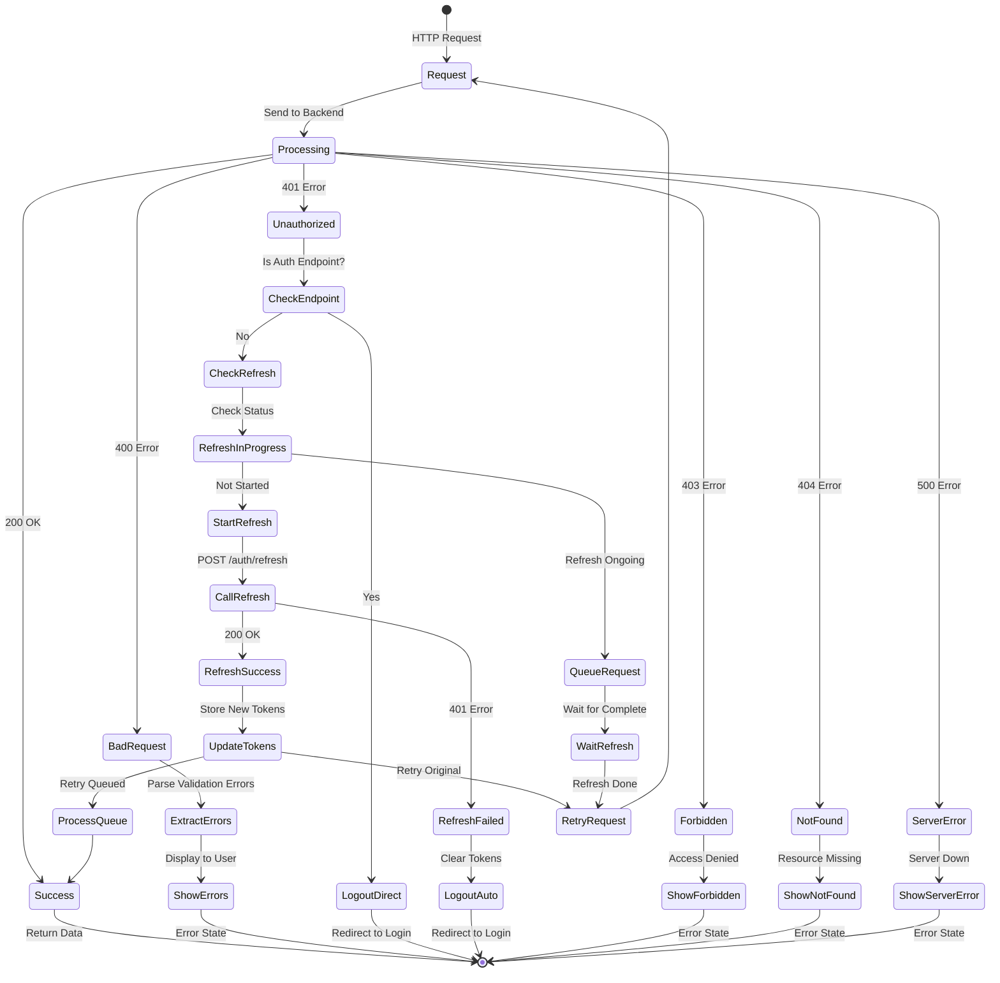
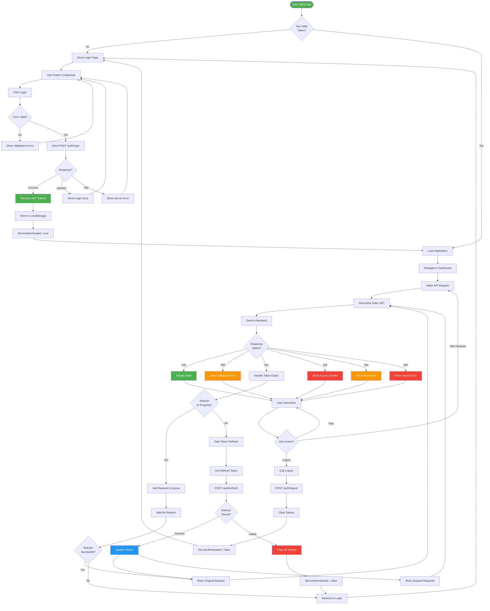
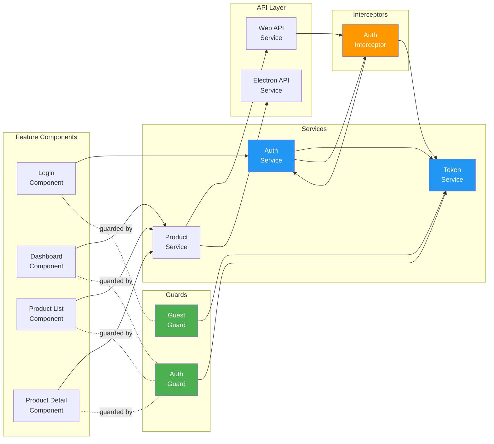

# Complete Application Architecture with Authentication

## Full System Architecture

## Request Flow with Authentication

## Error Handling State Machine

## Authentication Flow Diagram

## Token Lifecycle Timeline

```mermaid
gantt
    title JWT Token Lifecycle with Auto-Refresh
    dateFormat HH:mm
    axisFormat %H:%M
    
    section Access Token
    Valid Token         :active, at1, 00:00, 55m
    Warning Period      :crit, at2, 00:55, 4m
    About to Expire     :crit, at3, 00:59, 1m
    Expired             :done, at4, 01:00, 5m
    New Token Valid     :active, at5, 01:00, 55m
    
    section Refresh Process
    Idle                :r0, 00:00, 59m
    Refresh Triggered   :milestone, m1, 00:59, 0m
    Refreshing          :active, r1, 00:59, 1m
    New Token Issued    :milestone, m2, 01:00, 0m
    
    section User Experience
    Normal Usage        :active, u1, 00:00, 59m
    Seamless Transition :u2, 00:59, 1m
    Continue Working    :active, u3, 01:00, 1h
    
    section Background Tasks
    Monitor Expiry      :active, b1, 00:00, 2h
    Request Queue Empty :b2, 00:00, 59m
    Requests Queued     :crit, b3, 00:59, 1m
    Queue Processed     :done, b4, 01:00, 1m
```

## Component Dependency Graph

---

## Legend

| Color | Meaning |
|-------|---------|
| 🟢 Green | Success / Active / Allowed |
| 🟡 Orange | Warning / Processing / Validation |
| 🔴 Red | Error / Forbidden / Failed |
| 🔵 Blue | Service / Logic / Management |
| 🟣 Purple | Storage / Cache |
| 🔵 Cyan | Electron / IPC |

---

## Key Takeaways

1. **Seamless Authentication**: Users never see token refresh happening
2. **Automatic Recovery**: Failed requests are automatically retried after token refresh
3. **Request Queueing**: Multiple simultaneous requests handled efficiently
4. **Comprehensive Errors**: All HTTP errors handled with appropriate user feedback
5. **Type Safe**: Full TypeScript support throughout the stack
6. **Production Ready**: Enterprise-grade security and error handling

This architecture ensures a robust, secure, and user-friendly application! 🎉
