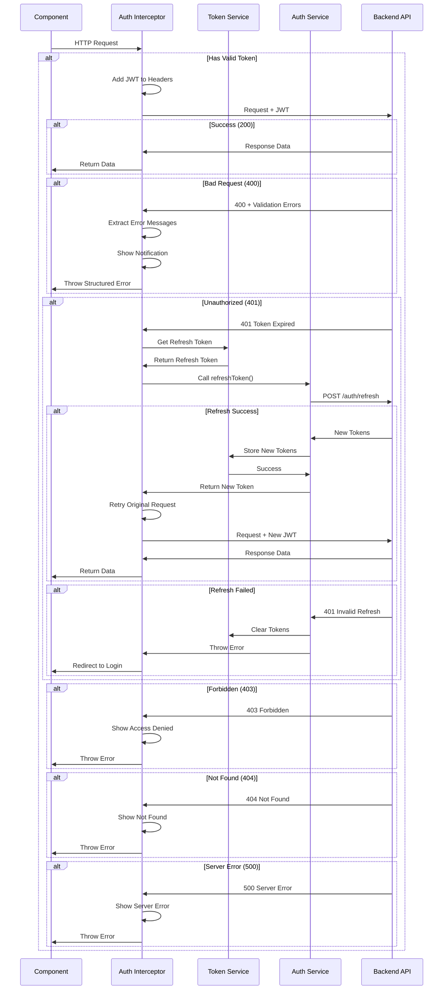
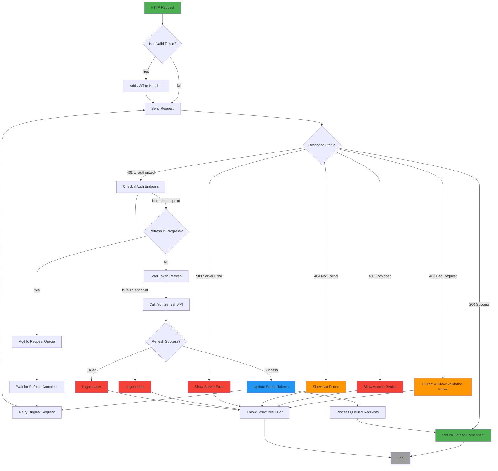
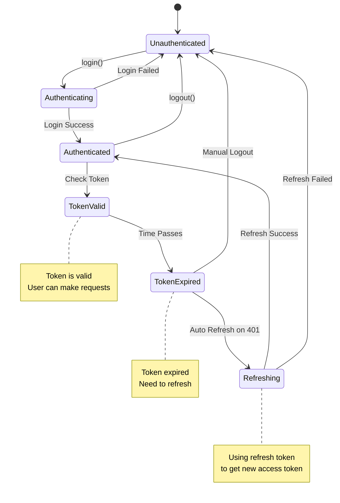
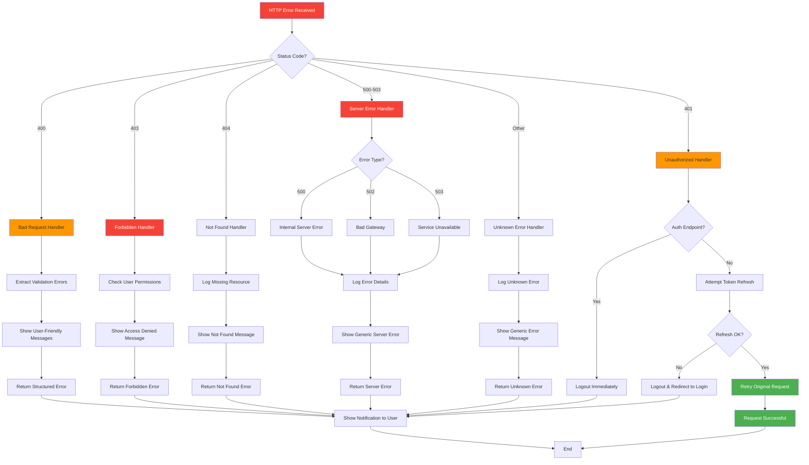
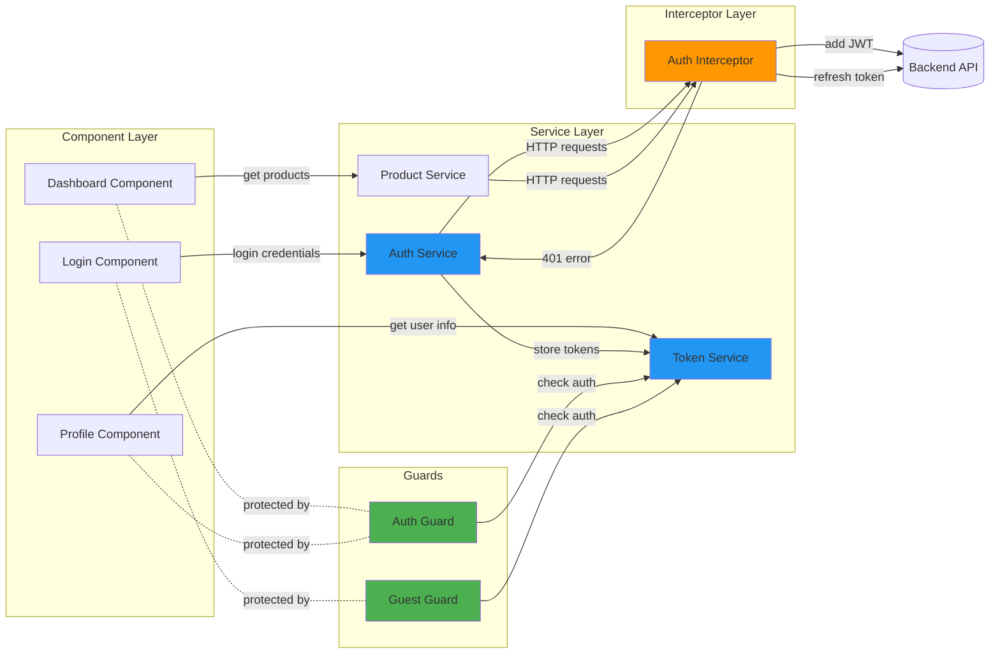

# Authentication & Error Handling Flow Diagrams

## Complete Request Flow with Error Handling

## Token Refresh with Request Queueing

## Authentication State Management

## Error Handling Decision Tree

## Component Integration Example

## Token Lifecycle

```mermaid
gantt
    title JWT Token Lifecycle
    dateFormat HH:mm:ss
    axisFormat %H:%M:%S
    
    section Access Token
    Valid Token    :active, t1, 00:00:00, 59m
    About to Expire :crit, t2, 00:59:00, 1m
    Expired        :done, t3, 01:00:00, 1m
    
    section Refresh Process
    Refresh Triggered :milestone, m1, 00:59:30, 0m
    Refreshing        :active, r1, 00:59:30, 30s
    New Token Issued  :milestone, m2, 01:00:00, 0m
    
    section User Experience
    Normal Usage      :active, u1, 00:00:00, 59m
    Seamless Refresh  :u2, 00:59:30, 30s
    Continue Usage    :active, u3, 01:00:00, 1m
```

---

## Quick Reference

### Error Status Codes

| Code | Name | Action | Retry? |
|------|------|--------|--------|
| 400 | Bad Request | Show validation errors | No |
| 401 | Unauthorized | Auto-refresh token | Yes (after refresh) |
| 403 | Forbidden | Show access denied | No |
| 404 | Not Found | Show not found | No |
| 500 | Server Error | Show server error | Optional |
| 502 | Bad Gateway | Show server down | Optional |
| 503 | Service Unavailable | Show maintenance | Optional |

### Token Refresh Triggers

1. **Automatic**: When 401 error received on authenticated endpoint
2. **Proactive**: When token is about to expire (30s buffer)
3. **Manual**: User clicks "refresh" button (optional)

### Security Best Practices

✅ Store tokens in localStorage (or HttpOnly cookies for production)  
✅ Always use HTTPS in production  
✅ Implement token expiry validation  
✅ Rotate refresh tokens on each use  
✅ Implement token blacklisting on logout  
✅ Add rate limiting on refresh endpoint  
✅ Use short-lived access tokens (15-60 min)  
✅ Use long-lived refresh tokens (7-30 days)  
✅ Validate tokens on every request (backend)  
✅ Log security events (failed logins, etc.)  
