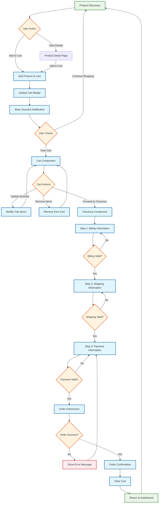
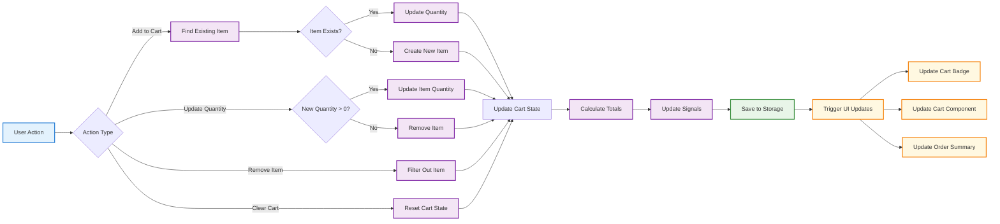
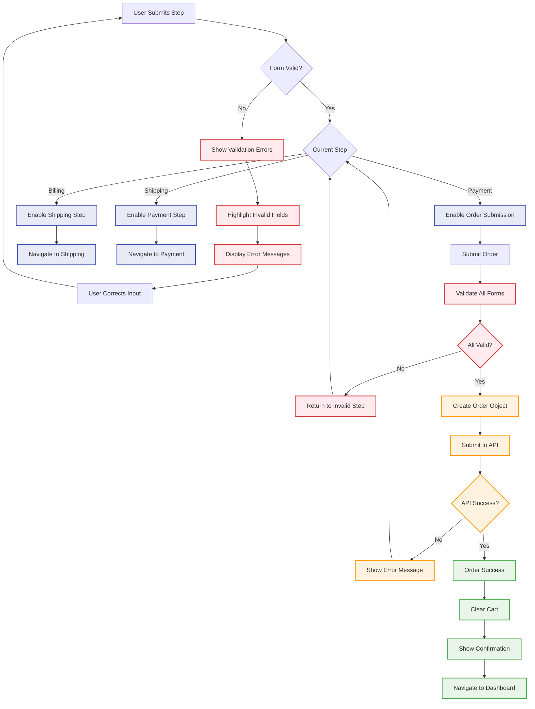
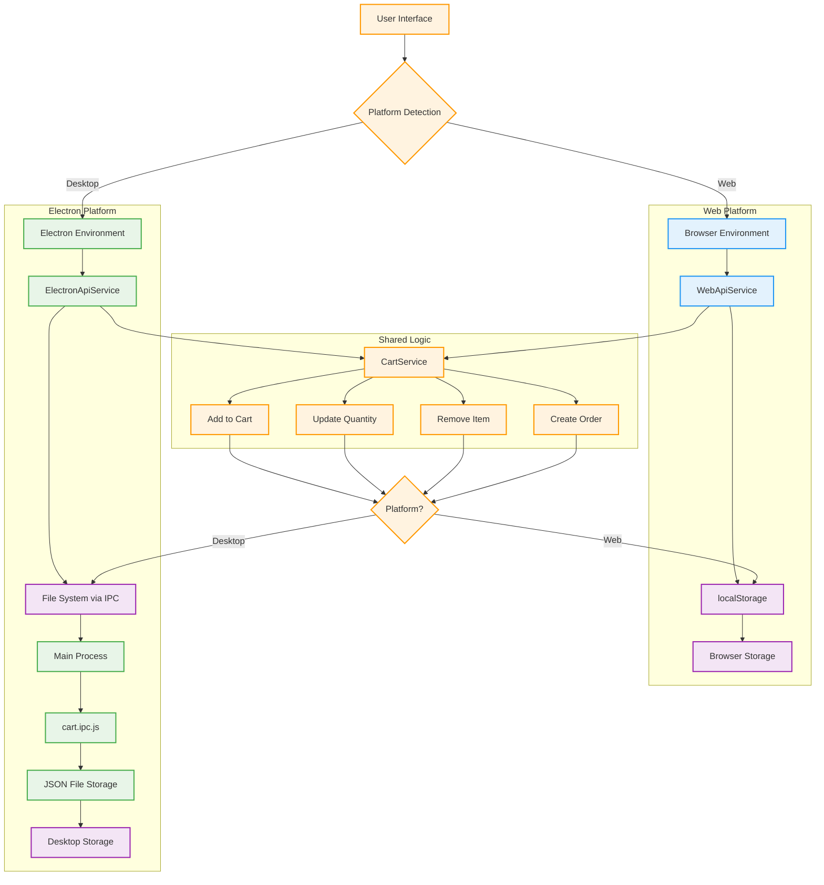
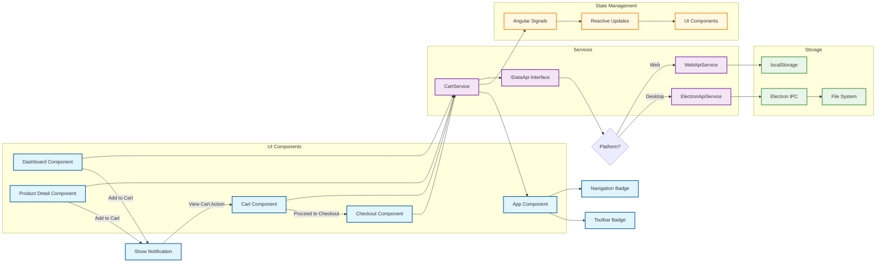
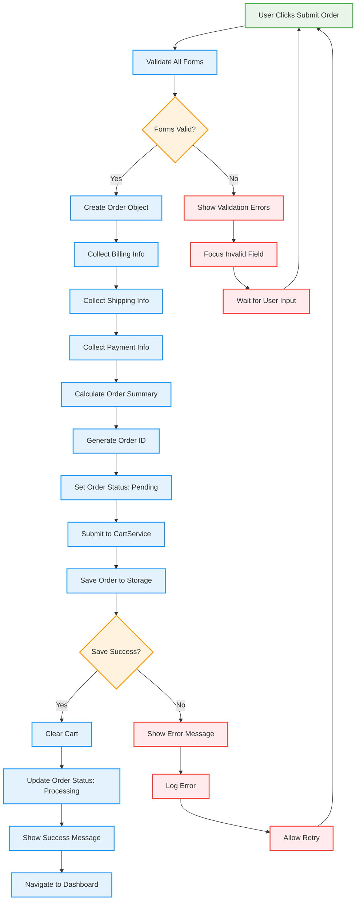

# Checkout Flow Diagrams

This document contains Mermaid diagrams that visualize the complete shopping cart and checkout flow for the Electron-Faker-Angular application.

## Complete User Journey Flowchart

## Cart Service State Management Flow

## Checkout Form Validation Flow

## Cross-Platform Architecture Flow

## Component Interaction Diagram

## Order Processing Sequence

These diagrams provide a comprehensive visual representation of the entire checkout flow, from initial product discovery through order completion, including error handling, cross-platform considerations, and component interactions.