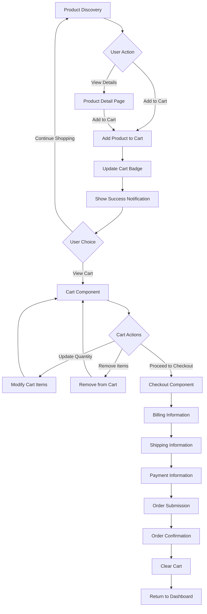

# Shopping Cart & Checkout Flow Documentation

## Overview

This document describes the complete shopping cart and checkout flow implementation for the Electron-Faker-Angular application. The system supports both web browser and Electron desktop environments with cross-platform cart persistence and a multi-step checkout process.

## Architecture Overview

```
┌─────────────────┐    ┌─────────────────┐    ┌─────────────────┐
│   Dashboard     │    │   Product       │    │   Cart          │
│   Component     │───▶│   Detail        │───▶│   Component     │
│                 │    │   Component     │    │                 │
└─────────────────┘    └─────────────────┘    └─────────────────┘
         │                       │                       │
         └───────────────────────┼───────────────────────┘
                                 ▼
                    ┌─────────────────┐
                    │   Checkout      │
                    │   Component     │
                    │                 │
                    └─────────────────┘
```

## Core Components

### 1. Cart Service (`src/app/core/services/cart.service.ts`)

**Purpose**: Centralized state management for shopping cart operations using Angular signals.

**Key Features**:
- Reactive state management with Angular signals
- Cross-platform persistence (localStorage for web, file system for Electron)
- Real-time calculations for totals, tax, and shipping
- Order processing and submission

**Public API**:
```typescript
// Reactive state
cart: Signal<Cart>                    // Current cart state
orders: Signal<Order[]>               // Order history
isEmpty: Signal<boolean>              // Cart empty state
itemCount: Signal<number>             // Total items in cart
cartSummary: Signal<CartSummary>      // Computed totals

// Actions
addToCart(product: Product, quantity?: number): void
removeFromCart(productId: number): void
updateQuantity(productId: number, quantity: number): void
clearCart(): void
createOrder(billingInfo: BillingInfo, shippingInfo: ShippingInfo, paymentInfo: PaymentInfo): Promise<Order>
```

### 2. Cart Component (`src/app/features/cart/cart.component.ts`)

**Purpose**: Display cart contents with quantity management and checkout initiation.

**Features**:
- Responsive design (table view for desktop, card view for mobile)
- Quantity controls with +/- buttons
- Item removal functionality
- Order summary with pricing breakdown
- "Proceed to Checkout" button

**Layout**:
- **Desktop**: Table layout with columns for image, product info, quantity, price, actions
- **Mobile**: Card-based layout with stacked information

### 3. Checkout Component (`src/app/features/checkout/checkout.component.ts`)

**Purpose**: Multi-step checkout form with validation and order submission.

**Features**:
- Three-step process: Billing → Shipping → Payment
- Form validation with real-time error display
- Multiple payment methods support
- Order summary sidebar
- Responsive design for all screen sizes

**Checkout Steps**:

#### Step 1: Billing Information
- Personal details (name, email, phone)
- Billing address (street, city, state, ZIP)
- Form validation for required fields

#### Step 2: Shipping Information
- Shipping address with "same as billing" option
- Shipping method selection (Standard, Express, Overnight)
- Cost calculation based on method

#### Step 3: Payment Information
- Payment method selection (Credit/Debit, PayPal, Crypto)
- Payment details form (conditional based on method)
- Final order review and submission

## Data Models

### Cart Interface
```typescript
interface Cart {
  items: CartItem[];
  totalItems: number;
  totalAmount: number;
  createdAt: Date;
  updatedAt: Date;
}

interface CartItem {
  product: Product;
  quantity: number;
  subtotal: number;
}

interface CartSummary {
  itemCount: number;
  subtotal: number;
  shipping: number;
  tax: number;
  total: number;
}
```

### Order Interface
```typescript
interface Order {
  id: string;
  items: CartItem[];
  billingInfo: BillingInfo;
  shippingInfo: ShippingInfo;
  paymentInfo: PaymentInfo;
  summary: CartSummary;
  status: 'pending' | 'processing' | 'shipped' | 'delivered' | 'cancelled';
  createdAt: Date;
  updatedAt: Date;
}
```

## User Flow Diagram



## Navigation Integration

### App Navigation (`src/app/app.html`)

**Sidebar Navigation**:
- Shopping Cart menu item with badge showing item count
- Badge hidden when cart is empty
- Active link highlighting when on cart page

**Top Toolbar**:
- Cart icon button with item count badge
- Tooltip showing "Shopping Cart"
- Direct navigation to cart page

**Badge Implementation**:
```html
<!-- Sidebar -->
<mat-icon [matBadge]="cartSummary().itemCount" 
          [matBadgeHidden]="cartSummary().itemCount === 0"
          matBadgeColor="accent">shopping_cart</mat-icon>

<!-- Toolbar -->
<button mat-icon-button routerLink="/cart" 
        [matBadge]="cartSummary().itemCount" 
        [matBadgeHidden]="cartSummary().itemCount === 0"
        matBadgeColor="accent"
        matTooltip="Shopping Cart">
  <mat-icon>shopping_cart</mat-icon>
</button>
```

## Cross-Platform Implementation

### Web Browser Mode
- **Storage**: localStorage for cart persistence
- **API**: WebApiService with HTTP client
- **Features**: Full cart and checkout functionality

### Electron Desktop Mode
- **Storage**: File system persistence via IPC
- **API**: ElectronApiService with secure IPC communication
- **Features**: Same functionality as web with native file storage

### IPC Implementation (`electron/ipc/cart.ipc.js`)

```javascript
// Cart persistence handlers
ipcMain.handle('cart:save', async (event, cartData) => {
  // Save cart to file system
});

ipcMain.handle('cart:load', async () => {
  // Load cart from file system
});

ipcMain.handle('order:submit', async (event, orderData) => {
  // Process and save order
});
```

## Routing Configuration

```typescript
// src/app/app.routes.ts
export const routes: Routes = [
  { path: '', redirectTo: '/dashboard', pathMatch: 'full' },
  { path: 'dashboard', loadComponent: () => import('./features/dashboard/dashboard.component') },
  { path: 'products', loadComponent: () => import('./features/products/product-list/product-list.component') },
  { path: 'products/:id', loadComponent: () => import('./features/products/product-detail/product-detail.component') },
  { path: 'cart', loadComponent: () => import('./features/cart/cart.component') },
  { path: 'checkout', loadComponent: () => import('./features/checkout/checkout.component') },
  { path: '**', redirectTo: '/dashboard' }
];
```

## State Management Flow

### Adding Items to Cart
1. User clicks "Add to Cart" on product
2. Dashboard/ProductDetail component calls `cartService.addToCart(product)`
3. CartService updates cart signal and persists to storage
4. Cart badge automatically updates via computed signal
5. Success notification displayed with "View Cart" option

### Cart Updates
1. User modifies quantity or removes items in cart
2. CartService updates cart state
3. All computed values (totals, item count) automatically recalculated
4. Changes persisted to storage
5. UI reactively updates

### Checkout Process
1. User proceeds from cart to checkout
2. Three-step form with validation
3. Order created with all form data
4. Cart cleared after successful submission
5. User redirected to dashboard

## Form Validation

### Billing Form
- Required: First Name, Last Name, Email, Street, City, State, ZIP
- Email format validation
- Optional: Phone number

### Shipping Form
- Same validation as billing
- "Same as billing" checkbox copies data
- Shipping method selection required

### Payment Form
- Conditional validation based on payment method
- Credit/Debit: Cardholder name, card number, expiry, CVV
- PayPal: Email validation
- Crypto: Wallet address validation

## Error Handling

### Cart Operations
- Storage errors fallback to empty cart
- Network errors show user-friendly messages
- Validation errors prevent invalid operations

### Checkout Process
- Form validation prevents progression with invalid data
- Payment processing errors shown to user
- Order submission failures allow retry

## Performance Considerations

### Lazy Loading
- Cart and checkout components lazy loaded
- Reduces initial bundle size
- Components loaded on demand

### Signal-Based Reactivity
- Efficient change detection
- Minimal re-renders
- Computed values cached until dependencies change

### Storage Optimization
- Cart data compressed before storage
- Automatic cleanup of old orders
- Efficient serialization/deserialization

## Testing Strategy

### Unit Tests
- Cart service operations
- Component interactions
- Form validation logic

### Integration Tests
- Cross-platform storage
- Complete checkout flow
- Navigation between components

### E2E Tests
- Full user journey from product selection to order completion
- Both web and Electron environments
- Mobile responsive behavior

## Development Guidelines

### Adding New Features
1. Update interfaces in `core/interfaces/`
2. Extend cart service if needed
3. Add UI components with proper validation
4. Update documentation and tests

### Styling Consistency
- Use Material Design components
- Follow responsive design patterns
- Maintain consistent spacing and colors

### Accessibility
- Proper ARIA labels
- Keyboard navigation support
- Screen reader compatibility

## Deployment

### Web Deployment
```bash
npm run build
# Deploy dist/ folder to web server
```

### Electron Packaging
```bash
npm run electron:build
# Creates distributable electron app
```

## Troubleshooting

### Common Issues

**Cart badge not updating**:
- Check property binding syntax: `[matBadge]` not `matBadge="{{ }}"`
- Verify cart service injection
- Check console for service errors

**Checkout form validation**:
- Ensure all required fields have validators
- Check FormGroup initialization
- Verify error message display logic

**Storage issues**:
- Check localStorage availability
- Verify Electron IPC handlers
- Monitor console for storage errors

### Debug Tools
- Browser DevTools for web version
- Electron DevTools for desktop version
- Angular DevTools for component inspection
- Console logging throughout cart service

## Future Enhancements

### Planned Features
- Wishlist functionality
- Product recommendations
- Order history and tracking
- Multiple shipping addresses
- Promotional codes and discounts
- Advanced payment options (Apple Pay, Google Pay)

### Performance Improvements
- Cart data caching
- Optimistic updates
- Background order processing
- Progressive web app features

This documentation provides a comprehensive overview of the shopping cart and checkout implementation, covering architecture, user flows, technical details, and operational guidelines.