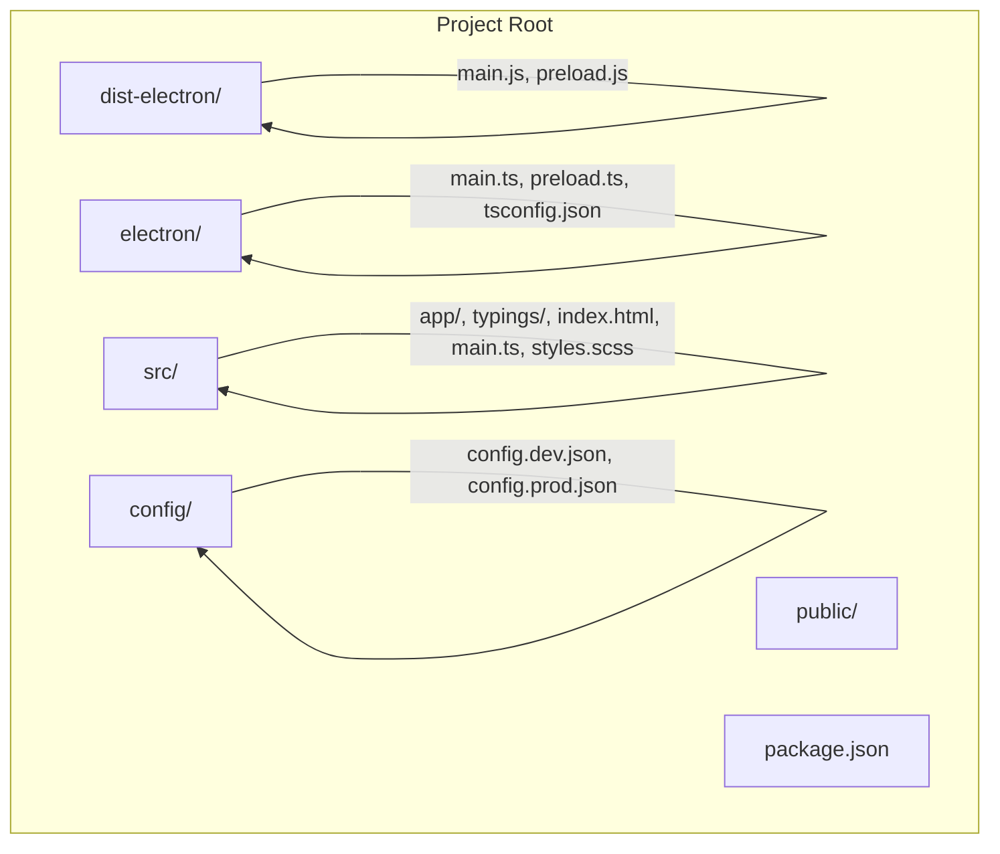
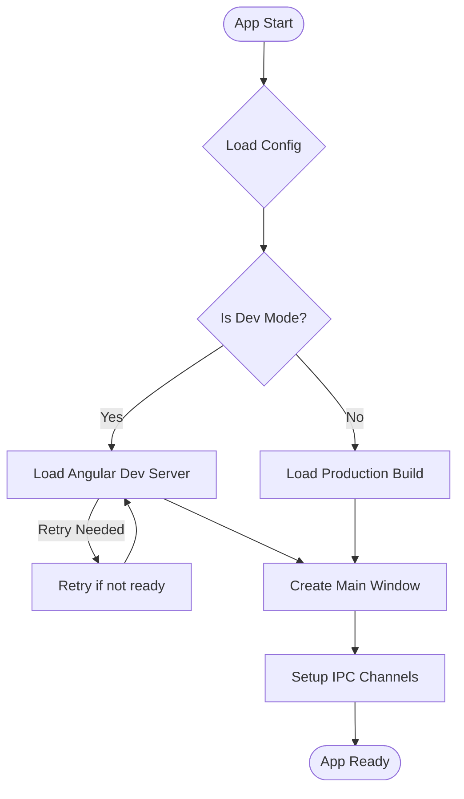
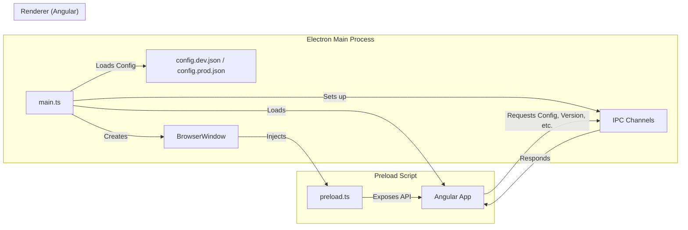
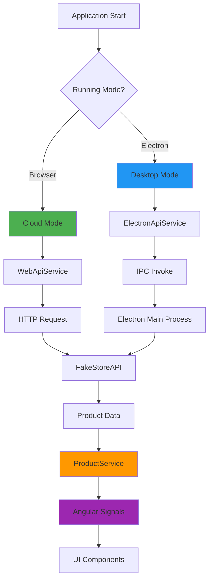

# Electron + Angular Desktop Application

This project combines Angular 20 with Electron 38 to create a cross-platform desktop application. It was generated using [Angular CLI](https://github.com/angular/angular-cli) version 20.3.4.

## 🚀 Quick Start

### Prerequisites
- Node.js (LTS version recommended)
- npm or yarn

### Installation
```bash
npm install
```

### Development Mode
To run the application in development mode:

```bash
npm run electron:serve
```

This command will:
1. Start the Angular dev server on `http://localhost:4200/`
2. Compile the Electron TypeScript files
3. Launch the Electron app with DevTools enabled

### Angular Only Development
To start only the Angular development server:

```bash
ng serve
```

Once the server is running, open your browser and navigate to `http://localhost:4200/`.

## 📁 Project Structure

```
electron-faker-angular/
├── dist-electron/          # Compiled Electron files
│   ├── main.js             # Main Electron process
│   └── preload.js          # Preload script
├── electron/               # Electron TypeScript source
│   ├── main.ts             # Main process source
│   ├── preload.ts          # Preload script source
│   └── tsconfig.json       # Electron TypeScript config
├── src/                    # Angular application source
│   ├── app/                # Angular app components
│   ├── typings/            # TypeScript definitions
│   ├── index.html          # Main HTML file
│   ├── main.ts             # Angular bootstrap
│   └── styles.scss         # Global styles
├── public/                 # Static assets
├── config/                 # Environment configuration files
│   ├── config.dev.json     # Development config
│   └── config.prod.json    # Production config
└── package.json            # Project dependencies and scripts
```

## 📊 Project Structure (Mermaid Diagram)



This diagram visually represents the main folders and files in your project. You can view it with a Mermaid preview extension in VS Code or on supported platforms.

## ⚡ Electron Main Process Workflow (Mermaid)



This diagram shows the startup logic of your Electron main process, including config loading, dev/prod branching, retry logic, and IPC setup.

## 🏛️ Application Architecture Flow (Mermaid)



This diagram shows the high-level architecture and data flow between Electron's main process, the preload script, and the Angular renderer process, including config usage and IPC communication.

## 🛠️ Available Scripts

- `npm run electron:serve` - Run in development mode (Angular + Electron)
- `npm run electron:build` - Compile Electron TypeScript files
- `npm run electron:dist` - Build for production and create distributables
- `ng serve` - Run only Angular development server
- `ng build` - Build Angular application for production
- `ng test` - Run unit tests

## 🔧 Building for Production

### Angular Build
```bash
ng build
```

### Electron Build
```bash
npm run electron:build
```

### Complete Production Build
```bash
npm run electron:dist
```

This will compile your project and create distributable packages in the `dist/` directory.

## 🧪 Testing

### Unit Tests
To execute unit tests with the [Karma](https://karma-runner.github.io) test runner:

```bash
ng test
```

## 🐛 Troubleshooting & Issue Resolution Log

### Issue #1: PowerShell Script Syntax Errors (Fixed)
**Problem**: `test.ps1` had syntax errors with missing closing braces and special character encoding issues.

**Error Messages**:
```
Missing closing '}' in statement block or type definition.
Unexpected token ')' in expression or statement.
```

**Solution**: 
- Fixed missing curly braces in the PowerShell function
- Replaced problematic Unicode characters (├──, │) with proper character codes
- Used string concatenation instead of format operators

**Files Modified**: `test.ps1`

### Issue #2: Electron Main Process Import Error (Fixed)
**Problem**: `app` was undefined when running TypeScript directly with ts-node.

**Error Message**:
```
TypeError: Cannot read properties of undefined (reading 'whenReady')
```

**Root Cause**: `ts-node electron/main.ts` couldn't properly import Electron modules in Node.js context.

**Solution**: 
- Modified `package.json` scripts to compile TypeScript first, then run with Electron
- Changed from: `ts-node electron/main.ts`
- Changed to: `tsc -p electron/tsconfig.json && electron dist-electron/main.js`

**Files Modified**: `package.json`

### Issue #3: Angular App Not Loading in Electron (Fixed)
**Problem**: Electron window opened but Angular application failed to load due to timing issues.

**Error Message**:
```
Failed to load URL: http://localhost:4200/ with error: ERR_CONNECTION_REFUSED
```

**Root Cause**: Electron tried to load Angular before the dev server was ready.

**Solution**: 
- Added retry logic with async/await in `electron/main.ts`
- Implemented 2-second delay retry mechanism
- Added proper error handling for connection failures

**Files Modified**: `electron/main.ts`

**Code Changes**:
```typescript
// Before: Direct URL loading
mainWindow.loadURL("http://localhost:4200");

// After: Retry logic with error handling
const loadAngularApp = async () => {
  try {
    await mainWindow!.loadURL("http://localhost:4200");
    mainWindow!.webContents.openDevTools();
  } catch (error) {
    console.log("Angular dev server not ready, retrying in 2 seconds...");
    setTimeout(loadAngularApp, 2000);
  }
};
loadAngularApp();
```

### Issue #4: Config-based Environment Loading & Logging (Improvement)
**Change**: Enhanced `electron/main.ts` to load environment-specific configuration files and improved logging.

**Details**:
- Loads `config.dev.json` or `config.prod.json` based on the environment (development or production)
- Uses the config to determine the Angular app URL and whether to enable DevTools
- Adds logging for startup, config loading, window creation, and error handling
- Exposes config to renderer process via IPC

**Files Modified**: `electron/main.ts`, `config/config.dev.json`, `config/config.prod.json`

**Code Example**:
```typescript
// --- Environment + Config ---
const isDev = !!process.env["ELECTRON_DEV"];
const configFile = isDev ? "config.dev.json" : "config.prod.json";
const configPath = path.join(__dirname, `../config/${configFile}`);

let config: any = {};
try {
  config = JSON.parse(fs.readFileSync(configPath, "utf-8"));
  log.info(`[startup] Loaded config: ${configPath}`);
} catch (err) {
  log.error(`[startup] Failed to load config: ${err}`);
}

// ...
if (isDev) {
  const loadAngularApp = async () => {
    try {
      await mainWindow!.loadURL(config.appUrl || "http://localhost:4200");
      if (config.enableDevTools) mainWindow!.webContents.openDevTools();
      log.info("[startup] Loaded Angular dev server successfully");
    } catch (error) {
      log.warn("Angular dev server not ready, retrying in 2 seconds...");
      setTimeout(loadAngularApp, 2000);
    }
  };
  loadAngularApp();
} else {
  const filePath = path.join(__dirname, "../dist/electron-faker-angular/browser/index.html");
  mainWindow.loadFile(filePath);
  log.info(`[startup] Loaded production build: ${filePath}`);
}
```

**How to Use**:
- Place your environment configs in the `config/` folder
- The app will automatically pick the correct config based on the environment
- All key startup events and errors are now logged for easier debugging

## 📝 Development Notes

### Key Dependencies
- **Angular**: ^20.3.0 (Latest Angular framework)
- **Electron**: ^38.2.2 (Desktop app framework)
- **TypeScript**: Latest (Type safety)
- **Bootstrap**: ^5.3.3 (UI framework)
- **Angular Material**: ^20.2.8 (Material Design components)

### Development Workflow
1. Run `npm run electron:serve` for full development
2. Both Angular and Electron will auto-reload on changes
3. Angular dev server starts first, Electron follows
4. DevTools are automatically opened in development mode

### Common Issues Prevention
- Always wait for Angular dev server to be ready before accessing the app
- Use the provided npm scripts instead of running commands manually
- Check that ports 4200 is available for Angular dev server
- Ensure all dependencies are installed with `npm install`

## 🔍 Debugging Tips

1. **Check Terminal Output**: Always monitor both Angular and Electron process outputs
2. **DevTools**: Use Electron DevTools (F12) for frontend debugging
3. **Console Logs**: Check both main process and renderer process logs
4. **Port Conflicts**: Ensure port 4200 is available for Angular dev server
5. **Clean Build**: If issues persist, delete `node_modules` and `dist-electron`, then reinstall

## 📄 Additional Resources

- [Angular Documentation](https://angular.io/docs)
- [Electron Documentation](https://www.electronjs.org/docs)
- [Angular CLI Reference](https://angular.io/cli)
- [Electron Builder](https://www.electron.build/)

---

## 🎨 Phase 3: Full Architecture Implementation

### Overview
The application now implements a complete **dual-mode architecture** supporting both:
- **Cloud Mode**: Web browser using HTTP API calls
- **Desktop Mode**: Electron app using IPC communication

### Architecture Components

#### 1. **Core Services Layer**

**IDataApi Interface** (`src/app/core/interfaces/idata-api.interface.ts`)
```typescript
abstract class IDataApi {
  abstract getAllProducts(): Observable<Product[]>;
  abstract getProductById(id: number): Observable<Product>;
  abstract getCategories(): Observable<string[]>;
  abstract getProductsByCategory(category: string): Observable<Product[]>;
}
```

**WebApiService** (Cloud Mode - HTTP)
- Implements `IDataApi` using Angular `HttpClient`
- Calls FakeStoreAPI directly via HTTPS
- Used when running in browser (`ng serve`)

**ElectronApiService** (Desktop Mode - IPC)
- Implements `IDataApi` using `window.electronAPI`
- Communicates with Electron main process via IPC
- Used when running in Electron (`npm run electron:serve`)

**ProductService** (Business Logic)
- Uses Angular Signals for reactive state management
- Injects `IDataApi` (automatically resolved to correct implementation)
- Provides computed signals: `products()`, `categories()`, `loading()`, `error()`

#### 2. **Electron IPC Layer**

**IPC Handlers** (`electron/ipc/product.ipc.ts`)
```typescript
registerProductHandlers():
  - products:getAll → Fetch all products from FakeStoreAPI
  - products:getById → Fetch single product by ID
  - products:getCategories → Fetch all categories
  - products:getByCategory → Fetch products in specific category
```

**Preload Script** (`electron/preload.ts`)
```typescript
window.electronAPI.products = {
  getAll: () => ipcRenderer.invoke('products:getAll'),
  getById: (id) => ipcRenderer.invoke('products:getById', id),
  getCategories: () => ipcRenderer.invoke('products:getCategories'),
  getByCategory: (category) => ipcRenderer.invoke('products:getByCategory', category)
}
```

**Main Process** (`electron/main.ts`)
- Registers IPC handlers before window creation
- Loads environment-specific config (dev/prod)
- Implements retry logic for Angular dev server

#### 3. **Authentication & Error Handling** 🔐🔒

The application includes a **production-ready JWT authentication system** with HttpOnly cookies for maximum security.

**🔒 Security Features:**
- **HttpOnly Cookie Storage** - Tokens stored in HttpOnly cookies (XSS protection)
- **No localStorage** - Eliminates JavaScript token access vulnerability
- **Automatic Cookie Handling** - Browser manages cookie transmission
- **CSRF Protection** - SameSite cookie flag prevents cross-site attacks
- **HTTPS Enforcement** - Secure flag ensures encrypted transmission
- **Automatic Token Refresh** - Seamless session management on 401 errors

**Key Features:**
- JWT token management via HttpOnly cookies (secure from XSS)
- Automatic token refresh on 401 errors
- HTTP request retry after token refresh
- Comprehensive error handling (400, 401, 403, 404, 500+)
- Route protection with auth guards
- Cookie-based authentication (no manual Authorization headers)

**Core Services:**

**TokenService** (`src/app/core/services/token.service.ts`)
- Manages authentication state (NOT token storage)
- User info in memory only
- Angular Signal for auth state
- **Security:** Tokens stored in HttpOnly cookies by backend, inaccessible to JavaScript

**AuthService** (`src/app/core/services/auth.service.ts`)
- Login/logout operations with `withCredentials: true`
- Token refresh using refresh token cookie
- User state management
- Integration with backend auth API
- **Security:** All requests include credentials for automatic cookie transmission

**AuthInterceptor** (`src/app/core/interceptors/auth.interceptor.ts`)
- Automatically includes credentials (cookies) in requests
- **NO Authorization header** - Browser sends cookies automatically
- Handles 400 (Bad Request) with validation errors
- Handles 401 (Unauthorized) with automatic token refresh
- Handles 403 (Forbidden) access denied
- Handles 404 (Not Found) resources
- Handles 500+ (Server Errors)
- Retries failed requests after successful token refresh
- Queues requests during token refresh

**Route Guards** (`src/app/core/guards/auth.guard.ts`)
- `authGuard` - Protects authenticated routes
- `guestGuard` - Prevents authenticated users from accessing login

**📚 Detailed Documentation:**
- **[🔒 HttpOnly Cookie Migration Guide](./HTTPONLY_COOKIE_MIGRATION.md)** - **Security improvement explanation & backend requirements**
- **[Authentication Implementation Guide](./AUTH_IMPLEMENTATION_GUIDE.md)** - Complete guide with code examples
- **[Flow Diagrams](./AUTH_FLOW_DIAGRAMS.md)** - Visual diagrams showing request flows and error handling
- **[Authentication Summary](./AUTH_SUMMARY.md)** - Quick reference and usage examples
- **[Architecture Diagrams](./ARCHITECTURE_DIAGRAMS.md)** - System architecture with Mermaid diagrams
- **[Quick Reference](./QUICK_REFERENCE.md)** - Commands, configuration, and troubleshooting

**🔐 Security Comparison:**

| Approach | XSS Vulnerable | JavaScript Access | CSRF Protection | Production Ready |
|----------|----------------|-------------------|-----------------|------------------|
| ❌ localStorage | YES | ✅ Full Access | ❌ None | ❌ NO |
| ✅ HttpOnly Cookies | NO | ❌ No Access | ✅ SameSite Flag | ✅ YES |

**Error Handling Examples:**

```typescript
// 400 Bad Request - Validation Errors
{
  status: 400,
  message: "Validation failed: Email is required, Password is too short",
  errors: [...]
}

// 401 Unauthorized - Automatic Token Refresh
Request → 401 Error → Refresh Token → Retry Request → Success

// 403 Forbidden - Access Denied
{
  status: 403,
  message: "Access Forbidden: You do not have permission"
}

// 500 Server Error
{
  status: 500,
  message: "Server error occurred. Please try again later."
}
```

**Token Refresh Flow:**
```
1. Request with expired token → 401 Error
2. Interceptor catches 401 → Calls /auth/refresh
3. Server returns new tokens → Update localStorage
4. Retry original request with new token → Success
5. Process any queued requests waiting for refresh
```

**Usage in Routes:**
```typescript
// Protect routes requiring authentication
{
  path: 'dashboard',
  component: DashboardComponent,
  canActivate: [authGuard]  // Protected route
}

// Prevent authenticated users from accessing login
{
  path: 'login',
  component: LoginComponent,
  canActivate: [guestGuard]  // Only for guests
}
```

#### 4. **UI Components**

**Dashboard** (`src/app/features/dashboard/`)
- Material cards grid layout
- Category filter chips
- Real-time product loading with signals
- Loading spinner and error handling

**Product List** (`src/app/features/products/product-list/`)
- Search functionality
- Category dropdown filter
- Horizontal card layout with thumbnails

**Product Detail** (`src/app/features/products/product-detail/`)
- Full product information display
- Image gallery
- Rating stars visualization
- Category chips (using updated `mat-chip-set`)

**Shared Components**
- `LoadingSpinnerComponent`: Material progress spinner
- `ErrorMessageComponent`: Error display with retry action
- `NavbarComponent`: Material toolbar with app title

#### 4. **Application Flow Diagram**



### Testing Results

#### ✅ Desktop Mode (Electron) - Verified October 14, 2025
```
[IPC] Product handlers registered successfully
[IPC] Handling products:getAll → Successfully fetched 20 products
[IPC] Handling products:getCategories → Successfully fetched 4 categories
[IPC] Handling products:getByCategory for: electronics → Successfully fetched 6 products
[IPC] Handling products:getByCategory for: jewelery → Successfully fetched 4 products
[IPC] Handling products:getByCategory for: men's clothing → Successfully fetched 4 products
[IPC] Handling products:getByCategory for: women's clothing → Successfully fetched 6 products
```

**Features Tested:**
- ✅ Dashboard loads all products via IPC
- ✅ Category filtering works for all 4 categories
- ✅ Product detail view loads correctly
- ✅ ElectronApiService → Preload → IPC → Main Process → FakeStoreAPI flow verified
- ✅ Loading states and error handling working
- ✅ Angular Signals reactive updates confirmed

#### 🔄 Cloud Mode (Browser) - To Be Tested
Run `ng serve` and verify:
- WebApiService makes direct HTTP calls
- All features work identically to desktop mode
- No IPC communication occurs

### Key Implementation Details

**Environment Detection** (`src/app/app.config.ts`)
```typescript
{
  provide: IDataApi,
  useFactory: (http: HttpClient) => {
    if (typeof window !== 'undefined' && (window as any).electronAPI) {
      return new ElectronApiService(); // Desktop Mode
    }
    return new WebApiService(http); // Cloud Mode
  },
  deps: [HttpClient]
}
```

**Material Design Integration**
- Theme: Indigo-Pink palette
- Components: Cards, Toolbar, Sidenav, Buttons, Icons, Chips, Progress Spinner
- Responsive layout with CSS Grid and Flexbox
- Smooth animations and transitions

**TypeScript Definitions** (`src/typings/electron.d.ts`)
```typescript
interface Window {
  electronAPI: {
    getAppVersion: () => Promise<string>;
    getAppConfig: () => Promise<any>;
    quitApp: () => void;
    products: {
      getAll: () => Promise<Product[]>;
      getById: (id: number) => Promise<Product>;
      getCategories: () => Promise<string[]>;
      getByCategory: (category: string) => Promise<Product[]>;
    };
  };
}
```

### Build & Run Commands

```bash
# Desktop Mode (Electron + Angular)
npm run electron:serve

# Cloud Mode (Browser only)
ng serve

# Compile Electron TypeScript
npm run electron:build

# Build for Production
npm run electron:dist
```

### Troubleshooting

**IPC Not Working?**
1. Check `dist-electron/` has compiled files
2. Verify `registerProductHandlers()` called in `main.ts`
3. Check Electron console for IPC logs

**Material Components Not Loading?**
1. Verify `@angular/material` installed: `npm list @angular/material`
2. Check component imports in each feature module
3. Ensure Material theme configured in `styles.scss`

**"mat-chip-list not found" Error?**
- Fixed in latest version - using `mat-chip-set` instead
- `mat-chip-list` deprecated in Material v15+

---

```bash
ng e2e
```

Angular CLI does not come with an end-to-end testing framework by default. You can choose one that suits your needs.

## Additional Resources

For more information on using the Angular CLI, including detailed command references, visit the [Angular CLI Overview and Command Reference](https://angular.dev/tools/cli) page.
