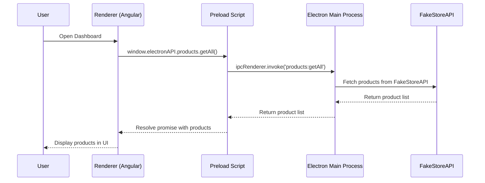
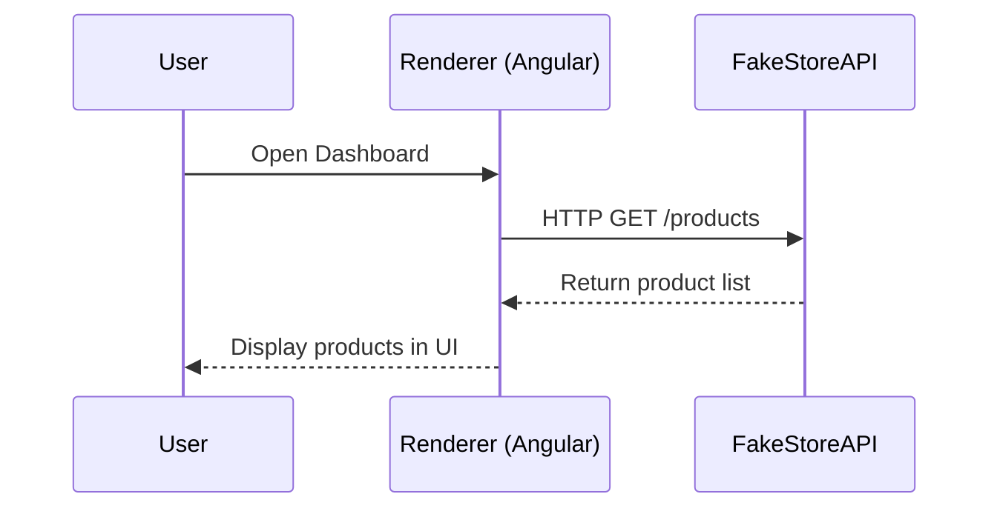
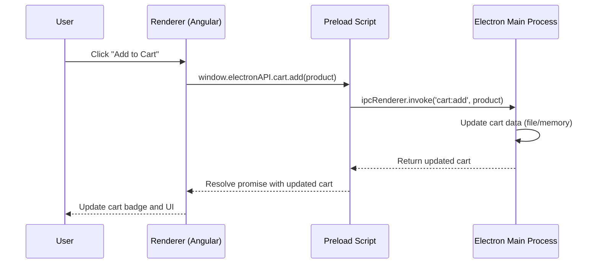
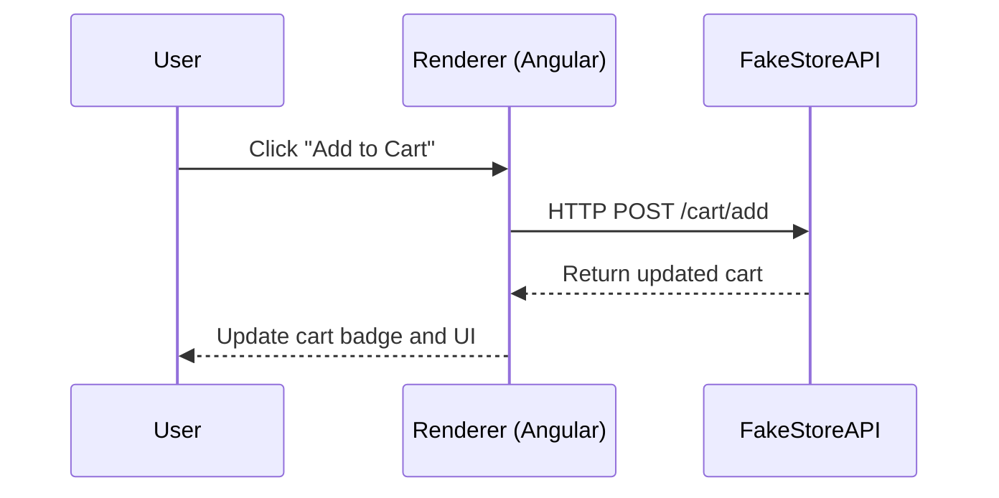
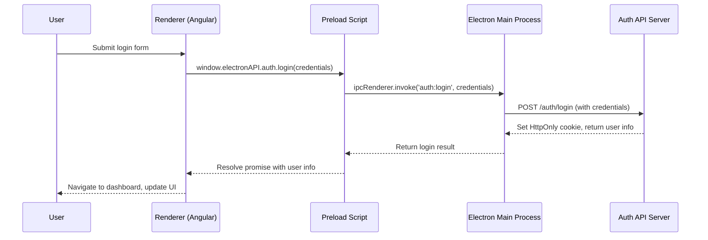
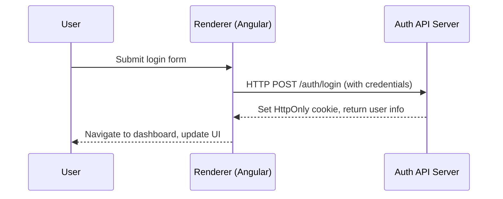

#  Scenario-Based Flows with Diagrams

Below are the most important flows in the application, step-by-step explanation. These will help new team members visualize and understand how data and events move through the system.

---


## 1. Product Loading Flow

### 🖥️ Desktop (Electron)


### ☁️ Web (Cloud)


---


## 2. Add to Cart Flow

### 🖥️ Desktop (Electron)


### ☁️ Web (Cloud)


---


## 3. Authentication Flow

### 🖥️ Desktop (Electron)


### ☁️ Web (Cloud)


---

Each diagram above matches a real scenario in the app. For every user action, follow the arrows to see how the request travels through Angular, the preload script, Electron's main process, and (if needed) external APIs, before returning data to the UI.
# �🖱️ Example Flow: Clicking "Add to Cart" in Electron

Let's walk through what happens when a user clicks the "Add to Cart" button in the Electron desktop app:

1. **User Action (Angular UI)**
  - User clicks "Add to Cart" on a product card in the Angular UI.
  - This triggers a method in the Angular component, e.g., `addToCart(product)`.

2. **Angular Service Call**
  - The component calls a method in the `CartService`, e.g., `cartService.addToCart(product)`.
  - `CartService` checks if the app is running in Electron by detecting `window.electronAPI`.

3. **IPC Call via Preload**
  - If in Electron, `CartService` calls `window.electronAPI.cart.add(product)` (as defined in `preload.ts` and typed in `electron.d.ts`).
  - The preload script uses `ipcRenderer.invoke('cart:add', product)` to send the request to the Electron main process.

4. **Electron Main Process Handler**
  - In `electron/ipc/cart.ipc.ts`, the main process listens for `'cart:add'` events.
  - It updates the cart data (e.g., in a file or memory) and returns the updated cart state.

5. **Response Back to Angular**
  - The main process sends the updated cart back through IPC.
  - The preload script resolves the promise, and Angular receives the new cart data.

6. **UI Update**
  - `CartService` updates its signals/state with the new cart.
  - The Angular UI automatically updates the cart badge, totals, and cart view.

**Summary:**
- The click triggers a method in Angular, which calls a service, which (in Electron) uses IPC via the preload script to update data in the Electron main process. The result flows back to Angular, updating the UI.

This pattern is used for all cross-process actions (e.g., loading products, updating cart, authentication), ensuring a secure and maintainable architecture.
# 🧩 How Electron, Preload, Angular, and Typings Work Together

This section explains the complete flow for new team members, including how the Electron main process, preload script, Angular app, and typings (`electron.d.ts`) interact to load products and handle IPC calls.

## 1. Electron Main Process (`electron/main.ts`)
- Starts the Electron app and creates the main application window.
- Loads the Angular app:
  - In development: waits for the Angular dev server (`http://localhost:4200`), with retry logic.
  - In production: loads the built Angular files from `dist/electron-faker-angular/browser/index.html`.
- Registers IPC handlers (e.g., for product data) before creating the window.
- Loads environment-specific config (dev/prod) and sets up logging.

## 2. Preload Script (`electron/preload.ts`)
- Runs in a secure context between Electron and Angular (renderer).
- Exposes a safe `window.electronAPI` object to Angular using `contextBridge`.
- Defines functions like `getAppVersion`, `getAppConfig`, and `products.getAll`, which internally use `ipcRenderer.invoke` to call main process handlers.
- Prevents direct Node.js access in the renderer for security.

## 3. Typings (`src/typings/electron.d.ts`)
- Declares the TypeScript types for `window.electronAPI`.
- Ensures Angular code gets full type safety and autocompletion for all Electron APIs exposed via preload.
- Example:
  ```typescript
  interface Window {
    electronAPI: {
      getAppVersion: () => Promise<string>;
      getAppConfig: () => Promise<any>;
      quitApp: () => void;
      products: {
        getAll: () => Promise<Product[]>;
        getById: (id: number) => Promise<Product>;
        getCategories: () => Promise<string[]>;
        getByCategory: (category: string) => Promise<Product[]>;
      };
    };
  }
  ```

## 4. Angular App (Renderer)
- Detects if `window.electronAPI` exists (i.e., running in Electron).
- Calls `window.electronAPI.products.getAll()` to fetch products, which triggers an IPC call to the main process.
- Uses Angular services and signals to manage product data and UI updates.

## 5. IPC Flow Example: Loading Products
1. Angular calls `window.electronAPI.products.getAll()`.
2. Preload script uses `ipcRenderer.invoke('products:getAll')` to send the request to the main process.
3. Main process (`main.ts` and `ipc/product.ipc.ts`) handles `'products:getAll'`, fetches data (e.g., from FakeStoreAPI), and returns it.
4. Preload receives the result and resolves the promise.
5. Angular receives the product data and updates the UI.

This architecture ensures strong security, type safety, and a clear separation of concerns between Electron, Angular, and the APIs they use to communicate.
# 📚 Recommended Reading Sequence for New Developers

If you are new to Electron.js or this project, follow this sequence to understand the flow, architecture, and how calls happen between Angular and Electron:

1. **README.md**
  - Start here for a high-level overview, project structure, and visual architecture diagrams (Mermaid).
  - Learn how to run the app in both web and desktop (Electron) modes.

2. **ARCHITECTURE_DIAGRAMS.md**
  - See system-level diagrams showing how Electron, Angular, and IPC (inter-process communication) interact.

3. **CHECKOUT_FLOW_DOCUMENTATION.md**
  - Read this for a step-by-step explanation of the shopping cart and checkout logic, including how Electron and Angular communicate.

4. **CHECKOUT_FLOW_DIAGRAMS.md**
  - Review visual flowcharts and diagrams for the checkout and cart process.

5. **AUTH_IMPLEMENTATION_GUIDE.md**
  - Understand the authentication flow, secure cookie handling, and route protection.

6. **PRODUCTION_LOGGING.md** and **LOGGING_GUIDE.md**
  - Learn how to debug, trace, and monitor the application in both development and production environments.

7. **HTTPONLY_COOKIE_MIGRATION.md** (Optional, for security details)
  - Deep dive into secure authentication and backend requirements.

This order will help you build a strong understanding of both the big picture and the technical details, even if you have never used Electron before.
# Electron + Angular Desktop Application

This project combines Angular 20 with Electron 38 to create a cross-platform desktop application. It was generated using [Angular CLI](https://github.com/angular/angular-cli) version 20.3.4.

## ✨ Features

### 🛒 Shopping Cart & Checkout System
- **Complete E-commerce Flow**: Full shopping cart functionality with add, remove, and quantity management
- **Multi-step Checkout**: Secure checkout process with billing, shipping, and payment forms
- **Cross-platform Persistence**: Cart data persists across sessions in both web and desktop modes
- **Real-time Updates**: Reactive cart badge and totals using Angular signals
- **Responsive Design**: Mobile-friendly cart and checkout components
- **Multiple Payment Methods**: Support for Credit/Debit cards, PayPal, and Cryptocurrency

### 🖥️ Cross-Platform Support
- **Web Browser**: Full functionality in modern web browsers
- **Desktop Application**: Native Electron app with secure IPC communication
- **Unified Codebase**: Same Angular components work in both environments
- **Persistent Storage**: localStorage for web, file system for desktop

### 🔧 Technical Features
- **Angular 20**: Latest Angular with standalone components and signals
- **Material Design**: Complete Material UI component library
- **TypeScript**: Full type safety with comprehensive interfaces
- **Environment Logging**: Smart logging system with dev/prod modes
- **Secure Architecture**: Protected IPC communication in Electron mode

## 🚀 Quick Start

### Prerequisites
- Node.js (LTS version recommended)
- npm or yarn

### Installation
```bash
npm install
```

### Development Mode
To run the application in development mode:

```bash
npm run electron:serve
```

This command will:
1. Start the Angular dev server on `http://localhost:4200/`
2. Compile the Electron TypeScript files
3. Launch the Electron app with DevTools enabled

### Angular Only Development
To start only the Angular development server:

```bash
ng serve
```

Once the server is running, open your browser and navigate to `http://localhost:4200/`.

## 📁 Project Structure


```
electron-faker-angular/
├── angular.json
├── package.json
├── package-lock.json
├── README.md
├── structure.txt
├── .gitignore
├── .vscode/
├── dist-electron/
│   ├── main.js
│   ├── preload.js
│   └── ipc/
│       ├── cart.ipc.js
│       └── product.ipc.js
├── electron/
│   ├── main.ts
│   ├── preload.ts
│   ├── tsconfig.json
│   └── ipc/
│       ├── cart.ipc.ts
│       └── product.ipc.ts
├── public/
│   └── favicon.ico
├── src/
│   ├── app/
│   │   ├── app.config.ts
│   │   ├── app.html
│   │   ├── app.routes.ts
│   │   ├── app.scss
│   │   ├── app.spec.ts
│   │   ├── app.ts
│   │   ├── core/
│   │   │   ├── interfaces/
│   │   │   │   ├── app-config.interface.ts
│   │   │   │   ├── cart.interface.ts
│   │   │   │   ├── idata-api.interface.ts
│   │   │   │   └── product.interface.ts
│   │   │   ├── services/
│   │   │   │   ├── auth.service.ts
│   │   │   │   ├── cart.service.ts
│   │   │   │   ├── electron-api.service.ts
│   │   │   │   ├── logger.service.ts
│   │   │   │   ├── product.service.ts
│   │   │   │   ├── token.service.ts
│   │   │   │   └── web-api.service.ts
│   │   │   ├── guards/
│   │   │   └── interceptors/
│   │   ├── features/
│   │   │   ├── auth/
│   │   │   ├── cart/
│   │   │   │   ├── cart.component.html
│   │   │   │   ├── cart.component.scss
│   │   │   │   └── cart.component.ts
│   │   │   ├── checkout/
│   │   │   │   ├── checkout.component.html
│   │   │   │   ├── checkout.component.scss
│   │   │   │   └── checkout.component.ts
│   │   │   ├── dashboard/
│   │   │   ├── products/
│   │   │   │   ├── product-list/
│   │   │   │   │   ├── product-list.component.html
│   │   │   │   │   ├── product-list.component.scss
│   │   │   │   │   └── product-list.component.ts
│   │   │   │   └── product-detail/
│   │   │   └── ...
│   │   ├── shared/
│   │   │   └── components/
│   │   │       ├── navbar/
│   │   │       │   └── navbar.component.ts
│   │   │       ├── loading-spinner/
│   │   │       │   └── loading-spinner.component.ts
│   │   │       └── error-message/
│   │   │           └── error-message.component.ts
│   ├── typings/
│   │   └── electron.d.ts
│   ├── index.html
│   ├── main.ts
│   └── styles.scss
├── config/
│   ├── config.dev.json
│   └── config.prod.json
├── release/
│   ├── Electron Faker Angular Setup 1.0.0.exe
│   ├── win-unpacked/
│   │   └── Electron Faker Angular.exe
│   └── ...
├── test.ps1
├── tsconfig.app.json
├── tsconfig.json
├── tsconfig.spec.json
... (other docs and markdown files)
```

## 📊 Project Structure (Mermaid Diagram)


This diagram visually represents the main folders and files in your project. You can view it with a Mermaid preview extension in VS Code or on supported platforms.

## ⚡ Electron Main Process Workflow (Mermaid)


This diagram shows the startup logic of your Electron main process, including config loading, dev/prod branching, retry logic, and IPC setup.

## 🏛️ Application Architecture Flow (Mermaid)


This diagram shows the high-level architecture and data flow between Electron's main process, the preload script, and the Angular renderer process, including config usage and IPC communication.

## 🛠️ Available Scripts

- `npm run electron:serve` - Run in development mode (Angular + Electron)
- `npm run electron:build` - Compile Electron TypeScript files
- `npm run electron:dist` - Build for production and create distributables
- `ng serve` - Run only Angular development server
- `ng build` - Build Angular application for production
- `ng test` - Run unit tests


## 🏗️ Building for Production & Distribution

### Important: Asset Loading in Electron

When building for Electron, always use:

```bash
ng build --base-href="./"
```

or run:

```bash
npm run electron:dist
```

This ensures all static assets (JS, CSS, images) load correctly in the packaged desktop app. If you see a blank screen or `net::ERR_FILE_NOT_FOUND` errors, check that `--base-href="./"` is set in your build script.

### Output Files & Distribution

- The Windows installer and unpacked .exe are generated in the `release/` folder:
  - `release/Electron Faker Angular Setup 1.0.0.exe` (installer)
  - `release/win-unpacked/Electron Faker Angular.exe` (portable .exe)
- Distribute only the files in `release/`—do not commit these to source control.

### .gitignore & Build Artifacts

- `dist-electron/` and `release/` are ignored by default (see `.gitignore`).
- If you see Git warnings about line endings (LF/CRLF) in build output, it is safe to ignore them. These files should not be tracked by Git.


### Angular Build
```bash
ng build
```

### Electron Build
```bash
npm run electron:build
```

### Complete Production Build
```bash
npm run electron:dist
```

This will compile your project and create distributable packages in the `release/` directory for Windows. The Angular production build will be in `dist/electron-faker-angular/`.
## ✅ Cross-Platform Testing Checklist

- [x] Web mode: `ng serve` — verify all features in browser
- [x] Desktop mode: `npm run electron:serve` — verify all features in Electron
- [x] Production .exe: `npm run electron:dist` — test the generated Windows executable
- [x] Cart, checkout, and authentication work in both modes
- [x] No asset loading or blank screen issues in production

## 🛠️ Troubleshooting

### Blank Screen or Asset Loading Errors in Electron

- **Symptom:** App window is blank, console shows `net::ERR_FILE_NOT_FOUND` for JS/CSS
- **Solution:** Ensure Angular is built with `--base-href="./"` (use `npm run electron:dist`)

### Git Warnings on Build Output

- **Symptom:** "LF will be replaced by CRLF" or similar warnings for files in `dist-electron/`
- **Solution:** These are safe to ignore. Make sure `dist-electron/` and `release/` are in `.gitignore` and not committed.

### Windows Executable Not Working

- **Symptom:** Double-clicking `.exe` does nothing or shows errors
- **Solution:** Ensure all dependencies are installed, and that you are running the `.exe` from `release/win-unpacked/` or after installing with the provided installer.

## 🔒 Security Note

This application uses **HttpOnly cookies** for authentication, providing strong protection against XSS and CSRF. No tokens are stored in JavaScript-accessible storage. See [HTTPONLY_COOKIE_MIGRATION.md](./HTTPONLY_COOKIE_MIGRATION.md) for details.

## 🧪 Testing

### Unit Tests
To execute unit tests with the [Karma](https://karma-runner.github.io) test runner:

```bash
ng test
```

## 📊 Logging & Debugging

The application includes comprehensive **environment-aware logging** that automatically adjusts based on build mode:

### 🔧 Development Mode (Logs Enabled)
- `ng serve` - Angular development server
- `npm run electron:serve` - Electron development mode
- **All logs visible** for debugging

### 📦 Production Mode (Logs Suppressed)
- `ng build` - Angular production build
- `npm run electron:dist` - Electron production build
- **Only errors logged** (performance + security)

### Log Prefixes
- `🌐 [WEB API]` - HTTP calls to FakeStoreAPI (Browser mode)
- `⚡ [ELECTRON IPC]` - IPC calls from renderer process (Desktop mode)
- `⚡ [ELECTRON MAIN]` - IPC handling in main process (Desktop mode)
- `🖥️ Running in Electron mode` - Application started in desktop mode
- `🌐 Running in Browser mode` - Application started in browser mode

### Viewing Logs

**Browser Mode (ng serve):**
- Open browser DevTools (F12)
- Console tab shows: `🌐 [WEB API]` logs
- **Development**: All logs visible
- **Production**: Only errors visible

**Desktop Mode (npm run electron:serve):**
- Electron DevTools (opens automatically in dev mode)
- Console tab shows: `⚡ [ELECTRON IPC]` logs
- Terminal shows: `⚡ [ELECTRON MAIN]` logs
- **Development**: All logs visible
- **Production**: Only errors visible

### 📚 Documentation
- **[PRODUCTION_LOGGING.md](./PRODUCTION_LOGGING.md)** - Environment-based logging configuration guide
- **[LOGGING_GUIDE.md](./LOGGING_GUIDE.md)** - Detailed examples and debugging tips
- **[CHECKOUT_FLOW_DOCUMENTATION.md](./CHECKOUT_FLOW_DOCUMENTATION.md)** - Complete shopping cart and checkout implementation guide
- **[CHECKOUT_FLOW_DIAGRAMS.md](./CHECKOUT_FLOW_DIAGRAMS.md)** - Visual flowcharts and diagrams for the checkout process

### LoggerService API

```typescript
import { LoggerService } from './core/services/logger.service';

constructor(private logger: LoggerService) {}

// Info/Log (dev only)
this.logger.log('🌐 [WEB API]', 'Fetching data');
this.logger.info('⚡', 'Processing request');

// Warnings (dev only)
this.logger.warn('⚠️', 'Deprecated API');

// Errors (always shown, even in production)
this.logger.error('❌', 'Request failed:', error);

// Check environment
if (this.logger.isDev()) {
  // Development-only code
}
```

## 🐛 Troubleshooting & Issue Resolution Log

### Issue #1: PowerShell Script Syntax Errors (Fixed)
**Problem**: `test.ps1` had syntax errors with missing closing braces and special character encoding issues.

**Error Messages**:
```
Missing closing '}' in statement block or type definition.
Unexpected token ')' in expression or statement.
```

**Solution**: 
- Fixed missing curly braces in the PowerShell function
- Replaced problematic Unicode characters (├──, │) with proper character codes
- Used string concatenation instead of format operators

**Files Modified**: `test.ps1`

### Issue #2: Electron Main Process Import Error (Fixed)
**Problem**: `app` was undefined when running TypeScript directly with ts-node.

**Error Message**:
```
TypeError: Cannot read properties of undefined (reading 'whenReady')
```

**Root Cause**: `ts-node electron/main.ts` couldn't properly import Electron modules in Node.js context.

**Solution**: 
- Modified `package.json` scripts to compile TypeScript first, then run with Electron
- Changed from: `ts-node electron/main.ts`
- Changed to: `tsc -p electron/tsconfig.json && electron dist-electron/main.js`

**Files Modified**: `package.json`

### Issue #3: Angular App Not Loading in Electron (Fixed)
**Problem**: Electron window opened but Angular application failed to load due to timing issues.

**Error Message**:
```
Failed to load URL: http://localhost:4200/ with error: ERR_CONNECTION_REFUSED
```

**Root Cause**: Electron tried to load Angular before the dev server was ready.

**Solution**: 
- Added retry logic with async/await in `electron/main.ts`
- Implemented 2-second delay retry mechanism
- Added proper error handling for connection failures

**Files Modified**: `electron/main.ts`

**Code Changes**:
```typescript
// Before: Direct URL loading
mainWindow.loadURL("http://localhost:4200");

// After: Retry logic with error handling
const loadAngularApp = async () => {
  try {
    await mainWindow!.loadURL("http://localhost:4200");
    mainWindow!.webContents.openDevTools();
  } catch (error) {
    console.log("Angular dev server not ready, retrying in 2 seconds...");
    setTimeout(loadAngularApp, 2000);
  }
};
loadAngularApp();
```

### Issue #4: Config-based Environment Loading & Logging (Improvement)
**Change**: Enhanced `electron/main.ts` to load environment-specific configuration files and improved logging.

**Details**:
- Loads `config.dev.json` or `config.prod.json` based on the environment (development or production)
- Uses the config to determine the Angular app URL and whether to enable DevTools
- Adds logging for startup, config loading, window creation, and error handling
- Exposes config to renderer process via IPC

**Files Modified**: `electron/main.ts`, `config/config.dev.json`, `config/config.prod.json`

**Code Example**:
```typescript
// --- Environment + Config ---
const isDev = !!process.env["ELECTRON_DEV"];
const configFile = isDev ? "config.dev.json" : "config.prod.json";
const configPath = path.join(__dirname, `../config/${configFile}`);

let config: any = {};
try {
  config = JSON.parse(fs.readFileSync(configPath, "utf-8"));
  log.info(`[startup] Loaded config: ${configPath}`);
} catch (err) {
  log.error(`[startup] Failed to load config: ${err}`);
}

// ...
if (isDev) {
  const loadAngularApp = async () => {
    try {
      await mainWindow!.loadURL(config.appUrl || "http://localhost:4200");
      if (config.enableDevTools) mainWindow!.webContents.openDevTools();
      log.info("[startup] Loaded Angular dev server successfully");
    } catch (error) {
      log.warn("Angular dev server not ready, retrying in 2 seconds...");
      setTimeout(loadAngularApp, 2000);
    }
  };
  loadAngularApp();
} else {
  const filePath = path.join(__dirname, "../dist/electron-faker-angular/browser/index.html");
  mainWindow.loadFile(filePath);
  log.info(`[startup] Loaded production build: ${filePath}`);
}
```

**How to Use**:
- Place your environment configs in the `config/` folder
- The app will automatically pick the correct config based on the environment
- All key startup events and errors are now logged for easier debugging

## 📝 Development Notes

### Key Dependencies
- **Angular**: ^20.3.0 (Latest Angular framework)
- **Electron**: ^38.2.2 (Desktop app framework)
- **TypeScript**: Latest (Type safety)
- **Bootstrap**: ^5.3.3 (UI framework)
- **Angular Material**: ^20.2.8 (Material Design components)

### Development Workflow
1. Run `npm run electron:serve` for full development
2. Both Angular and Electron will auto-reload on changes
3. Angular dev server starts first, Electron follows
4. DevTools are automatically opened in development mode

### Common Issues Prevention
- Always wait for Angular dev server to be ready before accessing the app
- Use the provided npm scripts instead of running commands manually
- Check that ports 4200 is available for Angular dev server
- Ensure all dependencies are installed with `npm install`

## 🔍 Debugging Tips

1. **Check Terminal Output**: Always monitor both Angular and Electron process outputs
2. **DevTools**: Use Electron DevTools (F12) for frontend debugging
3. **Console Logs**: Check both main process and renderer process logs
4. **Port Conflicts**: Ensure port 4200 is available for Angular dev server
5. **Clean Build**: If issues persist, delete `node_modules` and `dist-electron`, then reinstall

## 📄 Additional Resources

- [Angular Documentation](https://angular.io/docs)
- [Electron Documentation](https://www.electronjs.org/docs)
- [Angular CLI Reference](https://angular.io/cli)
- [Electron Builder](https://www.electron.build/)

---

## 🎨 Phase 3: Full Architecture Implementation

### Overview
The application now implements a complete **dual-mode architecture** supporting both:
- **Cloud Mode**: Web browser using HTTP API calls
- **Desktop Mode**: Electron app using IPC communication

### Architecture Components

#### 1. **Core Services Layer**

**IDataApi Interface** (`src/app/core/interfaces/idata-api.interface.ts`)
```typescript
abstract class IDataApi {
  abstract getAllProducts(): Observable<Product[]>;
  abstract getProductById(id: number): Observable<Product>;
  abstract getCategories(): Observable<string[]>;
  abstract getProductsByCategory(category: string): Observable<Product[]>;
}
```

**WebApiService** (Cloud Mode - HTTP)
- Implements `IDataApi` using Angular `HttpClient`
- Calls FakeStoreAPI directly via HTTPS
- Used when running in browser (`ng serve`)

**ElectronApiService** (Desktop Mode - IPC)
- Implements `IDataApi` using `window.electronAPI`
- Communicates with Electron main process via IPC
- Used when running in Electron (`npm run electron:serve`)

**ProductService** (Business Logic)
- Uses Angular Signals for reactive state management
- Injects `IDataApi` (automatically resolved to correct implementation)
- Provides computed signals: `products()`, `categories()`, `loading()`, `error()`

#### 2. **Electron IPC Layer**

**IPC Handlers** (`electron/ipc/product.ipc.ts`)
```typescript
registerProductHandlers():
  - products:getAll → Fetch all products from FakeStoreAPI
  - products:getById → Fetch single product by ID
  - products:getCategories → Fetch all categories
  - products:getByCategory → Fetch products in specific category
```

**Preload Script** (`electron/preload.ts`)
```typescript
window.electronAPI.products = {
  getAll: () => ipcRenderer.invoke('products:getAll'),
  getById: (id) => ipcRenderer.invoke('products:getById', id),
  getCategories: () => ipcRenderer.invoke('products:getCategories'),
  getByCategory: (category) => ipcRenderer.invoke('products:getByCategory', category)
}
```

**Main Process** (`electron/main.ts`)
- Registers IPC handlers before window creation
- Loads environment-specific config (dev/prod)
- Implements retry logic for Angular dev server

#### 3. **Authentication & Error Handling** 🔐🔒

The application includes a **production-ready JWT authentication system** with HttpOnly cookies for maximum security.

**🔒 Security Features:**
- **HttpOnly Cookie Storage** - Tokens stored in HttpOnly cookies (XSS protection)
- **No localStorage** - Eliminates JavaScript token access vulnerability
- **Automatic Cookie Handling** - Browser manages cookie transmission
- **CSRF Protection** - SameSite cookie flag prevents cross-site attacks
- **HTTPS Enforcement** - Secure flag ensures encrypted transmission
- **Automatic Token Refresh** - Seamless session management on 401 errors

**Key Features:**
- JWT token management via HttpOnly cookies (secure from XSS)
- Automatic token refresh on 401 errors
- HTTP request retry after token refresh
- Comprehensive error handling (400, 401, 403, 404, 500+)
- Route protection with auth guards
- Cookie-based authentication (no manual Authorization headers)

**Core Services:**

**TokenService** (`src/app/core/services/token.service.ts`)
- Manages authentication state (NOT token storage)
- User info in memory only
- Angular Signal for auth state
- **Security:** Tokens stored in HttpOnly cookies by backend, inaccessible to JavaScript

**AuthService** (`src/app/core/services/auth.service.ts`)
- Login/logout operations with `withCredentials: true`
- Token refresh using refresh token cookie
- User state management
- Integration with backend auth API
- **Security:** All requests include credentials for automatic cookie transmission

**AuthInterceptor** (`src/app/core/interceptors/auth.interceptor.ts`)
- Automatically includes credentials (cookies) in requests
- **NO Authorization header** - Browser sends cookies automatically
- Handles 400 (Bad Request) with validation errors
- Handles 401 (Unauthorized) with automatic token refresh
- Handles 403 (Forbidden) access denied
- Handles 404 (Not Found) resources
- Handles 500+ (Server Errors)
- Retries failed requests after successful token refresh
- Queues requests during token refresh

**Route Guards** (`src/app/core/guards/auth.guard.ts`)
- `authGuard` - Protects authenticated routes
- `guestGuard` - Prevents authenticated users from accessing login

**📚 Detailed Documentation:**
- **[🔒 HttpOnly Cookie Migration Guide](./HTTPONLY_COOKIE_MIGRATION.md)** - **Security improvement explanation & backend requirements**
- **[Authentication Implementation Guide](./AUTH_IMPLEMENTATION_GUIDE.md)** - Complete guide with code examples
- **[Flow Diagrams](./AUTH_FLOW_DIAGRAMS.md)** - Visual diagrams showing request flows and error handling
- **[Authentication Summary](./AUTH_SUMMARY.md)** - Quick reference and usage examples
- **[Architecture Diagrams](./ARCHITECTURE_DIAGRAMS.md)** - System architecture with Mermaid diagrams
- **[Quick Reference](./QUICK_REFERENCE.md)** - Commands, configuration, and troubleshooting

**🔐 Security Comparison:**

| Approach | XSS Vulnerable | JavaScript Access | CSRF Protection | Production Ready |
|----------|----------------|-------------------|-----------------|------------------|
| ❌ localStorage | YES | ✅ Full Access | ❌ None | ❌ NO |
| ✅ HttpOnly Cookies | NO | ❌ No Access | ✅ SameSite Flag | ✅ YES |

**Error Handling Examples:**

```typescript
// 400 Bad Request - Validation Errors
{
  status: 400,
  message: "Validation failed: Email is required, Password is too short",
  errors: [...]
}

// 401 Unauthorized - Automatic Token Refresh
Request → 401 Error → Refresh Token → Retry Request → Success

// 403 Forbidden - Access Denied
{
  status: 403,
  message: "Access Forbidden: You do not have permission"
}

// 500 Server Error
{
  status: 500,
  message: "Server error occurred. Please try again later."
}
```

**Token Refresh Flow:**
```
1. Request with expired token → 401 Error
2. Interceptor catches 401 → Calls /auth/refresh
3. Server returns new tokens → Update localStorage
4. Retry original request with new token → Success
5. Process any queued requests waiting for refresh
```

**Usage in Routes:**
```typescript
// Protect routes requiring authentication
{
  path: 'dashboard',
  component: DashboardComponent,
  canActivate: [authGuard]  // Protected route
}

// Prevent authenticated users from accessing login
{
  path: 'login',
  component: LoginComponent,
  canActivate: [guestGuard]  // Only for guests
}
```

#### 4. **UI Components**

**Dashboard** (`src/app/features/dashboard/`)
- Material cards grid layout
- Category filter chips
- Real-time product loading with signals
- Loading spinner and error handling

**Product List** (`src/app/features/products/product-list/`)
- Search functionality
- Category dropdown filter
- Horizontal card layout with thumbnails

**Product Detail** (`src/app/features/products/product-detail/`)
- Full product information display
- Image gallery
- Rating stars visualization
- Category chips (using updated `mat-chip-set`)

**Shared Components**
- `LoadingSpinnerComponent`: Material progress spinner
- `ErrorMessageComponent`: Error display with retry action
- `NavbarComponent`: Material toolbar with app title

#### 4. **Application Flow Diagram**


### Testing Results

#### ✅ Desktop Mode (Electron) - Verified October 14, 2025
```
[IPC] Product handlers registered successfully
[IPC] Handling products:getAll → Successfully fetched 20 products
[IPC] Handling products:getCategories → Successfully fetched 4 categories
[IPC] Handling products:getByCategory for: electronics → Successfully fetched 6 products
[IPC] Handling products:getByCategory for: jewelery → Successfully fetched 4 products
[IPC] Handling products:getByCategory for: men's clothing → Successfully fetched 4 products
[IPC] Handling products:getByCategory for: women's clothing → Successfully fetched 6 products
```

**Features Tested:**
- ✅ Dashboard loads all products via IPC
- ✅ Category filtering works for all 4 categories
- ✅ Product detail view loads correctly
- ✅ ElectronApiService → Preload → IPC → Main Process → FakeStoreAPI flow verified
- ✅ Loading states and error handling working
- ✅ Angular Signals reactive updates confirmed

#### 🔄 Cloud Mode (Browser) - To Be Tested
Run `ng serve` and verify:
- WebApiService makes direct HTTP calls
- All features work identically to desktop mode
- No IPC communication occurs

### Key Implementation Details

**Environment Detection** (`src/app/app.config.ts`)
```typescript
{
  provide: IDataApi,
  useFactory: (http: HttpClient) => {
    if (typeof window !== 'undefined' && (window as any).electronAPI) {
      return new ElectronApiService(); // Desktop Mode
    }
    return new WebApiService(http); // Cloud Mode
  },
  deps: [HttpClient]
}
```

**Material Design Integration**
- Theme: Indigo-Pink palette
- Components: Cards, Toolbar, Sidenav, Buttons, Icons, Chips, Progress Spinner
- Responsive layout with CSS Grid and Flexbox
- Smooth animations and transitions

**TypeScript Definitions** (`src/typings/electron.d.ts`)
```typescript
interface Window {
  electronAPI: {
    getAppVersion: () => Promise<string>;
    getAppConfig: () => Promise<any>;
    quitApp: () => void;
    products: {
      getAll: () => Promise<Product[]>;
      getById: (id: number) => Promise<Product>;
      getCategories: () => Promise<string[]>;
      getByCategory: (category: string) => Promise<Product[]>;
    };
  };
}
```

### Build & Run Commands

```bash
# Desktop Mode (Electron + Angular)
npm run electron:serve

# Cloud Mode (Browser only)
ng serve

# Compile Electron TypeScript
npm run electron:build

# Build for Production
npm run electron:dist
```

### Troubleshooting

**IPC Not Working?**
1. Check `dist-electron/` has compiled files
2. Verify `registerProductHandlers()` called in `main.ts`
3. Check Electron console for IPC logs

**Material Components Not Loading?**
1. Verify `@angular/material` installed: `npm list @angular/material`
2. Check component imports in each feature module
3. Ensure Material theme configured in `styles.scss`

**"mat-chip-list not found" Error?**
- Fixed in latest version - using `mat-chip-set` instead
- `mat-chip-list` deprecated in Material v15+

---

```bash
ng e2e
```

Angular CLI does not come with an end-to-end testing framework by default. You can choose one that suits your needs.

## Additional Resources

For more information on using the Angular CLI, including detailed command references, visit the [Angular CLI Overview and Command Reference](https://angular.dev/tools/cli) page.
