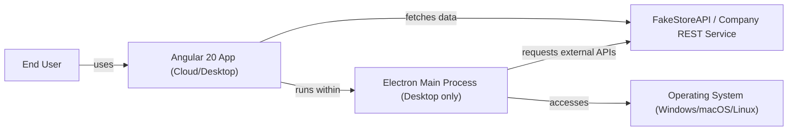
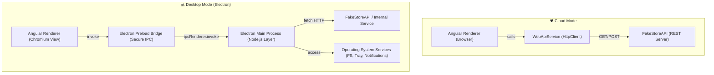
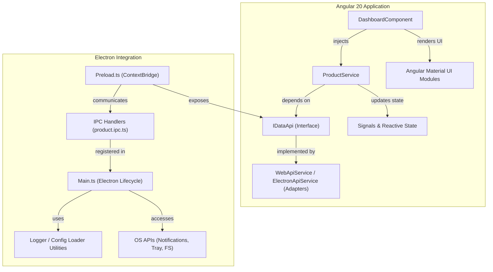
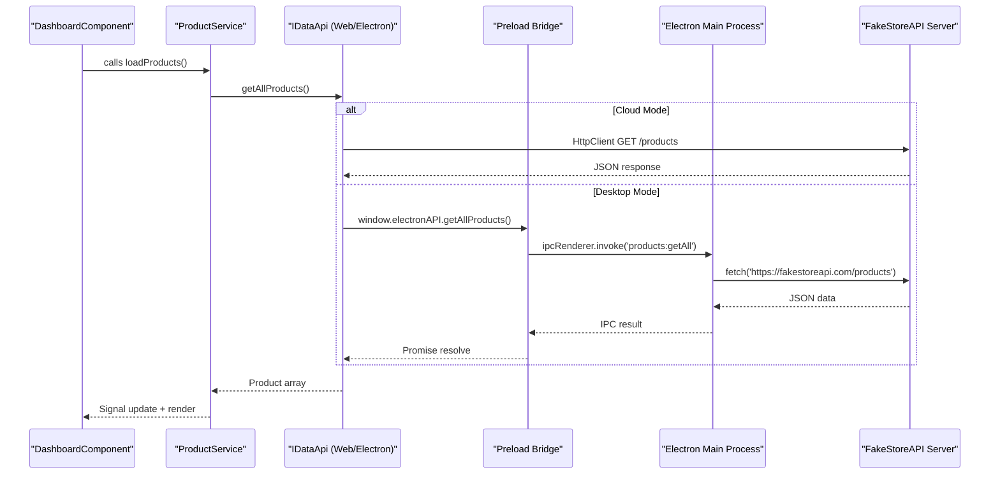

# System Architecture Documentation

## C1 – System Context Diagram

Shows how the overall system interacts with external entities (users, APIs, OS).

**Explanation**
- The user interacts with one UI — Angular 20.
- In cloud mode, Angular talks directly to FakeStore API.
- In desktop mode, Angular runs inside Electron → Electron handles OS & API access.

---

## 🧩 C2 – Container Diagram

Shows main runtime containers and responsibilities.

**Explanation**
- Cloud mode: Angular → HttpClient → API.
- Desktop mode: Angular → Preload → Main Process → API/OS.
- Both share identical Angular components, routing, and Material UI.

---

## ⚙️ C3 – Component Diagram

Shows the Angular + Electron internal structure and dependency boundaries.

**Explanation**
- IDataApi acts as the abstraction boundary.
- Angular never knows whether it’s calling Electron or HTTP.
- Electron side isolates Node and OS logic behind IPC.

---

## 🔍 C4 – Code/Interaction Flow Diagram

Shows the step-by-step runtime call chain for a “Get All Products” request.

**Explanation**
- Both paths end up delivering identical product data to the component.
- Desktop uses IPC, web uses HttpClient.
- UI remains unaware of environment differences.

---

## 🧠 Summary: Architectural Value

| Layer                                   | Purpose                              | Shared Between Cloud & Desktop |
|------------------------------------------|--------------------------------------|:-----------------------------:|
| Angular Components + Signals + Material UI | Pure presentation & state            | ✅ Yes                        |
| ProductService + IDataApi interface      | Business abstraction boundary         | ✅ Yes                        |
| WebApiService                           | Cloud-specific API access             | 🌐 Only                      |
| ElectronApiService + IPC Handlers        | Desktop bridge & system integration   | 💻 Only                      |
| Electron Main Process                    | Secure Node/OS access, logging, config| 💻 Only                      |

