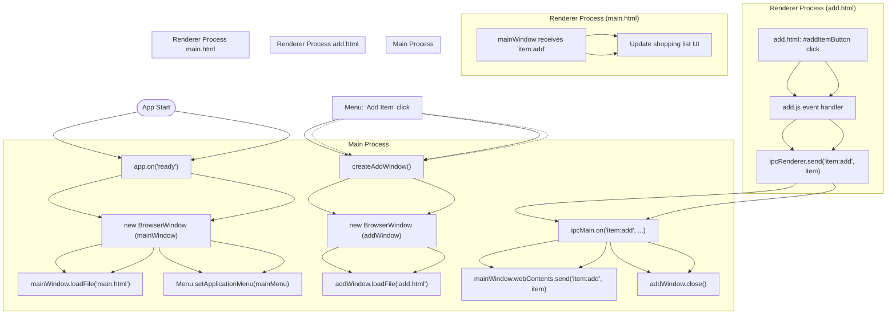
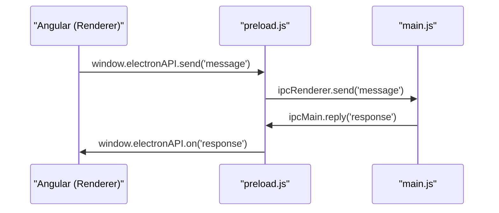
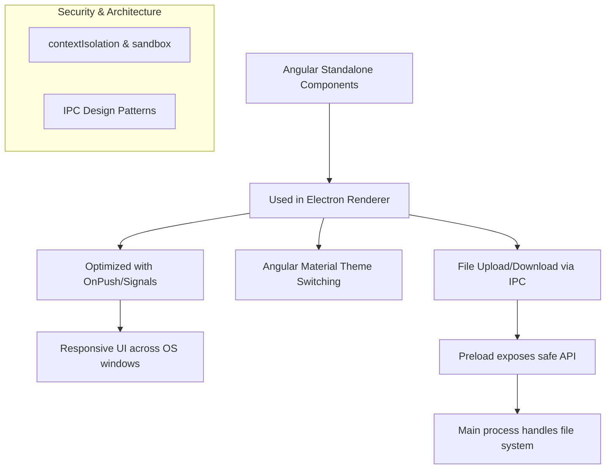
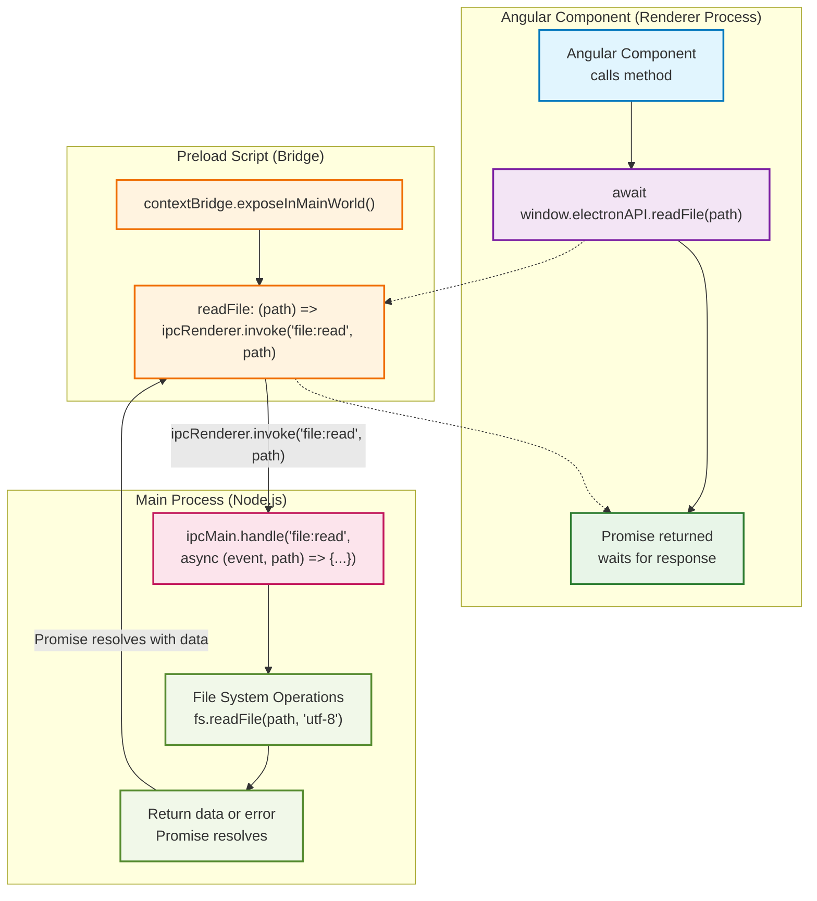
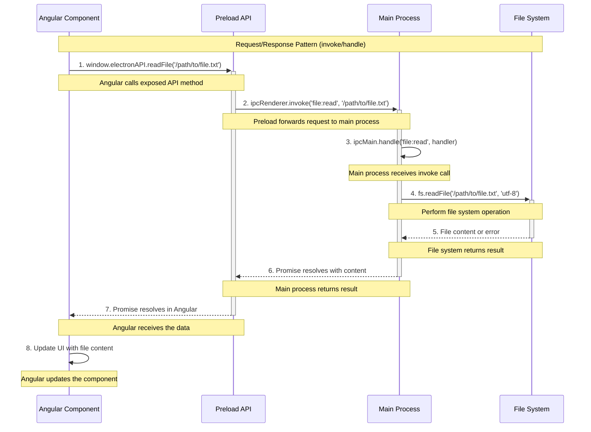
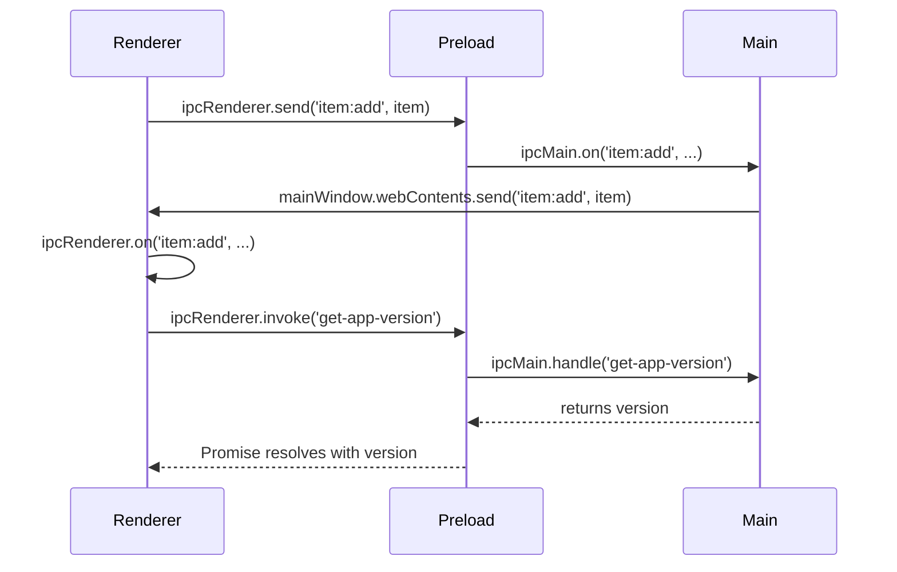

# Electron Faker

A simple Electron app demonstrating window management, IPC communication, and menu customization. This project is ideal for beginners to learn the basics of Electron.

## Features
- Main window with a shopping list
- Add item window (modal)
- Inter-process communication (IPC) between windows
- Custom application menus
- Developer Tools access for both main and add windows

## Getting Started

### Prerequisites
- [Node.js](https://nodejs.org/) (v14 or higher recommended)
- [npm](https://www.npmjs.com/)

### Installation
1. Clone or download this repository.
2. Open a terminal in the project directory.
3. Run:
   ```sh
   npm install
   ```

### Running the App
Start the Electron app with:
```sh
npm run electron
```

## Project Structure
```
index.js        # Main process: creates windows, handles menus, IPC
main.html       # Main window UI
add.html        # Add item window UI
add.js          # Renderer script for add.html
package.json    # Project metadata and scripts
```

## How It Works
1. **App Launch**: `index.js` creates the main window and loads `main.html`.
2. **Menu**: The main window has a menu with options to add items and open Developer Tools.
3. **Add Item**: Selecting "Add Item" opens a new window (`add.html`).
4. **IPC Communication**: When an item is added in `add.html`, it is sent to the main process using IPC and the add window closes.
5. **Developer Tools**: Both windows have menu options to open DevTools for debugging.

## Application Flow (with Mermaid)



## Security Notes
- Node integration is enabled for simplicity. For production, consider using preload scripts and disabling node integration for better security.
- You may see security warnings in the console during development. These are expected and safe to ignore for learning purposes.

## License
MIT

---

## Electron & Angular  Q&A

### 1. Core Questions (Basics)
**Q1. What is Electron JS?**

Electron is a framework for building cross-platform desktop applications using web technologies (HTML, CSS, JavaScript). It bundles a Chromium renderer and Node.js runtime, allowing you to build desktop apps using the same codebase for Windows, macOS, and Linux.

**Q2. What are the two main processes in Electron?**

- **Main Process:** Runs in Node.js environment. Manages windows, menus, file system, and native APIs.
- **Renderer Process:** Runs each web page (like an Angular app) inside Chromium. Handles the UI.

**Q3. What is the role of main.js in Electron?**

main.js is the entry point of an Electron app. It runs the main process and:
- Creates BrowserWindows
- Loads your Angular app (index.html)
- Handles IPC communication
- Manages app lifecycle (quit, minimize, etc.)

**Q4. What is preload.js and why is it needed?**

preload.js runs before the renderer loads and acts as a secure bridge between the isolated Angular app and the Node.js environment. It exposes safe APIs using contextBridge so that Angular can talk to Electron without having full Node access.

**Q5. What is contextBridge in Electron?**

contextBridge safely exposes limited functionality to the renderer.
Example:
```js
contextBridge.exposeInMainWorld('electronAPI', {
  saveData: (data) => ipcRenderer.send('save-data', data)
});
```
This prevents direct require('fs') or system access inside Angular, improving security.

**Q6. How do Angular and Electron communicate?**

Via IPC (Inter-Process Communication):
- ipcRenderer (in preload.js or renderer)
- ipcMain (in main.js)

**Flow:**


### 2. Intermediate Questions
**Q7. Why should we disable nodeIntegration and enable contextIsolation?**

For security reasons. If nodeIntegration is true, your Angular code can access Node APIs directly (require('fs')), allowing malicious scripts to run OS-level commands. contextIsolation: true ensures your app and preload run in separate JS contexts.

**Q8. How can you package an Electron + Angular app for production?**

Use electron-builder or electron-forge. They bundle your Angular build (dist/) with the Electron runtime and create installers (.exe, .dmg, .AppImage).

**Q9. How can you update an Electron app automatically?**

Use the electron-updater module. It checks for updates from a server (GitHub, S3, etc.) and downloads them silently in the background.

**Q10. How do you debug an Electron + Angular app?**

- Use win.webContents.openDevTools() in Electron.
- Add "sourceMap": true in Angular build for debugging TypeScript.
- Use Chrome DevTools for the renderer and console.log() for the main process.

**Q11. How can Electron access local files from Angular?**

Angular can’t directly use Node’s fs module. Instead, call a preload-exposed API:
```js
(window as any).electronAPI.readFile('path/to/file.txt');
```
Then in preload.js, use ipcRenderer to ask main.js to perform the fs.readFile() operation.

**Q12. What are common performance bottlenecks in Electron apps?**

- Loading large Angular bundles → use lazy loading & route chunking
- Heavy IPC traffic → use throttling or SSE/WebSocket alternatives
- Memory leaks from unclosed windows or event listeners
- Too many BrowserWindows (each runs a Chromium instance)

**Q13. How do you store data locally in Electron?**

Options:
- JSON file via fs
- sqlite3 or better-sqlite3
- electron-store (simple key-value)
- Secure data with keytar (credentials)

**Q14. How do you handle authentication securely in Electron?**

- Use Keycloak or OAuth 2.0 via Angular.
- Store tokens securely in OS keychain via keytar.
- Never store credentials in localStorage or plain files.

### 3. Advanced / Architect-Level Questions
**Q15. How do you design a secure bridge between Angular and Electron?**

- Use contextBridge.exposeInMainWorld()
- Validate all IPC inputs in ipcMain before executing
- Return sanitized data only
- Never expose require or eval functions to renderer

**Q16. How do you structure a large Electron + Angular project?**

Typical enterprise layout:
```
/electron
  main.js
  preload.js
  services/
    file.service.js
/angular
  src/app/
    core/
    shared/
    features/
  environments/
```
Follow separation of concerns — Angular handles UI; Electron handles OS logic.

**Q17. How do you integrate native OS features (tray, notifications, clipboard)?**

Use Electron APIs inside main or preload:
```js
const { Tray, Notification, clipboard } = require('electron');
```
Expose only what’s needed to Angular through contextBridge.

**Q18. How can you use Angular’s routing with Electron?**

- Use Angular’s RouterModule normally.
- Ensure base-href is ./ when building for Electron so file:// URLs resolve correctly.

**Q19. How do you implement auto-launch at startup (Windows/macOS)?**

Use the app.setLoginItemSettings() API in Electron or a library like auto-launch.

**Q20. How do you handle versioning and environment configuration in Electron?**

- Store runtime config in config.json
- Load config from Electron main process before Angular bootstrap
- Expose via preload using contextBridge

---

## Angular-Electron Advanced Concepts (Mermaid Diagram)



---

## Advanced Electron-Angular Architecture & IPC Patterns (Mermaid)



### Detailed invoke/handle Flow Explanation



### Understanding the Architecture Flow

This diagram illustrates the secure, modern architecture pattern for Electron applications with Angular. Here's how each component works:

#### 1. **Angular Standalone Component (Renderer Process)**
- **Purpose**: Modern Angular entry point that doesn't require NgModule
- **Benefits**: Faster startup, tree-shakable, modular architecture
- **In Electron**: Serves as the UI layer running in Chromium's renderer process
- **Example**:
```typescript
// main.ts
import { bootstrapApplication } from '@angular/platform-browser';
import { AppComponent } from './app/app.component';

bootstrapApplication(AppComponent);
```

#### 2. **Preload API (contextBridge)**
- **Purpose**: Secure bridge between isolated renderer and Node.js environment
- **Security**: Prevents direct access to Node.js APIs while exposing safe methods
- **Implementation**: Uses Electron's `contextBridge.exposeInMainWorld()`
- **Example**:
```javascript
// preload.js
const { contextBridge, ipcRenderer } = require('electron');

contextBridge.exposeInMainWorld('electronAPI', {
  // Safe, controlled API exposure
  openFile: () => ipcRenderer.invoke('dialog:openFile'),
  saveFile: (data) => ipcRenderer.invoke('file:save', data),
  onFileChanged: (callback) => ipcRenderer.on('file:changed', callback)
});
```

#### 3. **window.electronAPI**
- **Purpose**: The exposed API available in Angular components
- **Access**: Global object accessible via `(window as any).electronAPI`
- **Type Safety**: Can be typed with TypeScript interfaces
- **Example**:
```typescript
// In Angular component
interface ElectronAPI {
  openFile(): Promise<string>;
  saveFile(data: any): Promise<boolean>;
  onFileChanged(callback: (event: any, data: any) => void): void;
}

declare global {
  interface Window {
    electronAPI: ElectronAPI;
  }
}

// Usage in component
async openFile() {
  const filePath = await window.electronAPI.openFile();
  console.log('Selected file:', filePath);
}
```

#### 4. **IPC Communication Patterns**

**A. Request/Response (invoke/handle) - Promise-based**
- **Use Case**: When Angular needs data from main process
- **Pattern**: Async/await with Promise return values
- **Example**:
```javascript
// Renderer (Angular)
const result = await window.electronAPI.getUserData();

// Main Process
ipcMain.handle('get-user-data', async () => {
  return await database.getUser();
});
```

**B. Fire-and-Forget (send/on) - Event-based**
- **Use Case**: Notifications, updates, one-way communication
- **Pattern**: Event emission without expecting response
- **Example**:
```javascript
// Renderer (Angular)
window.electronAPI.notifyAction('user-logged-in');

// Main Process
ipcMain.on('notify-action', (event, action) => {
  console.log('Action received:', action);
  // Broadcast to all windows
  BrowserWindow.getAllWindows().forEach(win => {
    win.webContents.send('global-notification', action);
  });
});
```

#### 5. **Main Process Architecture**

**Business Logic Layer**:
- **Purpose**: Handles core application logic, file system operations, database interactions
- **Separation**: Keeps UI logic separate from business logic
- **Example**:
```javascript
// services/fileService.js
class FileService {
  async readFile(filePath) {
    return await fs.readFile(filePath, 'utf-8');
  }
  
  async writeFile(filePath, data) {
    return await fs.writeFile(filePath, data);
  }
}

// main.js
const fileService = new FileService();

ipcMain.handle('file:read', async (event, filePath) => {
  return await fileService.readFile(filePath);
});
```

#### 6. **Security Best Practices Implemented**

- **Context Isolation**: Renderer runs in isolated context
- **No Node Integration**: Renderer cannot directly access Node.js
- **Controlled API Surface**: Only specific functions exposed via contextBridge
- **Input Validation**: All IPC inputs validated in main process
- **Principle of Least Privilege**: Minimal necessary APIs exposed

#### 7. **Performance Optimizations**

- **Lazy Loading**: Angular features loaded on demand
- **Efficient IPC**: Minimal data transfer between processes
- **Caching**: Frequent operations cached in appropriate process
- **Resource Management**: Proper cleanup of event listeners and resources

### Real-World Implementation Example

```typescript
// Angular Service
@Injectable({
  providedIn: 'root'
})
export class ElectronService {
  constructor() {}

  async loadUserPreferences(): Promise<UserPreferences> {
    return await window.electronAPI.getUserPreferences();
  }

  async saveDocument(document: Document): Promise<boolean> {
    return await window.electronAPI.saveDocument(document);
  }

  onDocumentChanged(callback: (doc: Document) => void): void {
    window.electronAPI.onDocumentChanged(callback);
  }
}
```

```javascript
// Main Process Handler
class DocumentManager {
  constructor() {
    this.setupIPC();
  }

  setupIPC() {
    ipcMain.handle('get-user-preferences', this.getUserPreferences.bind(this));
    ipcMain.handle('save-document', this.saveDocument.bind(this));
    ipcMain.on('document-changed', this.handleDocumentChange.bind(this));
  }

  async getUserPreferences() {
    // Business logic for loading preferences
    return await this.preferencesService.load();
  }

  async saveDocument(event, document) {
    // Validate and save document
    const result = await this.documentService.save(document);
    
    // Notify all windows of change
    this.broadcastDocumentChange(document);
    
    return result;
  }
}
```

> **Tip:** Use `ipcRenderer.invoke`/`ipcMain.handle` for request/response (Promise-based) communication between renderer and main process in Electron.

This architecture ensures a secure, maintainable, and performant Electron application with modern Angular features.

---

### Angular-Electron Advanced Add-Ons: Q&A

**Q: How do you use Standalone Components with Electron?**
A: Standalone Components in Angular can be used as entry points for your Electron renderer process. You bootstrap them in your Angular app, and Electron loads the Angular build (index.html) as the UI. This allows for modular, maintainable code and faster startup times.

**Q: How do you optimize Angular for a desktop (OnPush, Signals)?**
A: Use Angular's `ChangeDetectionStrategy.OnPush` to minimize change detection cycles, and leverage Angular Signals for reactive state management. This reduces CPU usage and improves performance, which is important for desktop apps running in Chromium.

**Q: How do you handle Angular Material theme switching in Electron?**
A: Implement Angular Material's theming system and expose a theme-switching API in your renderer. You can persist the user's theme preference using Electron's IPC and local storage or the file system, and apply the theme dynamically in the Angular app.

**Q: How do you implement file upload/download via IPC?**
A: Expose a safe API in preload.js using contextBridge for file operations. Use ipcRenderer in Angular to call this API. Example:
```js
// In preload.js
contextBridge.exposeInMainWorld('electron', {
  uploadFile: (filePath) => ipcRenderer.invoke('dialog:openFile', filePath),
  downloadFile: (url) => ipcRenderer.invoke('download:start', url)
});

// In Angular component
(window as any).electron.uploadFile('path/to/file').then(...);
```

**Q: How do you ensure responsive design across OS windows?**
A: Use CSS media queries and Angular's responsive utilities. Test your app on different OS window sizes and adjust your layouts, fonts, and controls to ensure a consistent and user-friendly experience.

---

## Electron IPC Patterns: invoke, send, and on

### ipcRenderer.invoke
`ipcRenderer.invoke` is used for asynchronous, two-way communication between the renderer and main process. It returns a Promise with the result from the main process.

**Example:**

**preload.js**
```js
const { contextBridge, ipcRenderer } = require('electron');
contextBridge.exposeInMainWorld('electronAPI', {
  readFile: (filePath) => ipcRenderer.invoke('read-file', filePath)
});
```

**main.js**
```js
const { ipcMain } = require('electron');
const fs = require('fs').promises;
ipcMain.handle('read-file', async (event, filePath) => {
  return await fs.readFile(filePath, 'utf-8');
});
```

**Angular (renderer):**
```ts
(window as any).electronAPI.readFile('path/to/file.txt').then(content => {
  console.log(content);
});
```

---

### ipcRenderer.send & ipcRenderer.on

- `ipcRenderer.send(channel, ...args)` sends a one-way asynchronous message from the renderer to the main process. No direct response is expected.
- `ipcRenderer.on(channel, listener)` listens for messages from the main process in the renderer.

**Example:**

**Renderer:**
```js
ipcRenderer.send('item:add', item);
```

**Main process:**
```js
ipcMain.on('item:add', (event, item) => {
  // Handle the item
  mainWindow.webContents.send('item:add', item); // Optionally send to renderer
});
```

**Renderer (to receive):**
```js
ipcRenderer.on('item:add', (event, item) => {
  // Update the UI with the new item
});
```

---

### Request/Response IPC with invoke/handle (Promise-based)

`ipcRenderer.invoke` (in the renderer) and `ipcMain.handle` (in the main process) are used together for request/response communication. This pattern lets the renderer ask the main process to do something and get a result back as a Promise.

**Example:**

**preload.js**
```js
const { contextBridge, ipcRenderer } = require('electron');
contextBridge.exposeInMainWorld('electronAPI', {
  getAppVersion: () => ipcRenderer.invoke('get-app-version')
});
```

**main.js**
```js
const { app, ipcMain } = require('electron');
ipcMain.handle('get-app-version', async () => {
  return app.getVersion();
});
```

**renderer (Angular):**
```ts
(window as any).electronAPI.getAppVersion().then(version => {
  console.log('App version:', version);
});
```

**Mermaid Diagram:**


**Summary:**
- Use `ipcRenderer.send` to send messages to the main process.
- Use `ipcRenderer.on` to receive messages from the main process.
- Use `ipcRenderer.invoke`/`ipcMain.handle` for request/response (Promise-based) communication.

These patterns help you build robust, secure, and maintainable Electron + Angular applications.
- Renderer calls `invoke` and gets a Promise.
- Main process handles the request and returns a value.
- Use this for any async operation where the renderer needs a result from the main process.

### Electron IPC Communication Patterns Explained

#### 1. `ipcRenderer.send` / `ipcMain.on` (One-way, Fire-and-Forget)
- **Purpose:** Send a message from the renderer to the main process without expecting a direct response.
- **Usage:**
  - Renderer: `ipcRenderer.send('channel', data)`
  - Main: `ipcMain.on('channel', (event, data) => { ... })`
- **Example:**
```js
// Renderer (Angular or plain JS)
window.electronAPI.addItem('Buy milk');

// Preload (exposed API)
addItem: (item) => ipcRenderer.send('item:add', item)

// Main process
ipcMain.on('item:add', (event, item) => {
  // Handle the item (e.g., add to list)
});
```
- **When to use:**
  - User actions that don't require a result (logging, notifications, updates)

#### 2. `ipcRenderer.on` / `webContents.send` (Main to Renderer)
- **Purpose:** Main process sends messages to renderer(s), renderer listens for updates.
- **Usage:**
  - Main: `mainWindow.webContents.send('channel', data)`
  - Renderer: `ipcRenderer.on('channel', (event, data) => { ... })`
- **Example:**
```js
// Main process
mainWindow.webContents.send('item:added', item);

// Renderer
ipcRenderer.on('item:added', (event, item) => {
  // Update UI with new item
});
```
- **When to use:**
  - Notify renderer of changes, push updates, or broadcast events

#### 3. `ipcRenderer.invoke` / `ipcMain.handle` (Request/Response, Promise-based)
- **Purpose:** Renderer requests data or an operation from the main process and waits for a result (async/await).
- **Usage:**
  - Renderer: `const result = await ipcRenderer.invoke('channel', args)`
  - Main: `ipcMain.handle('channel', async (event, args) => { ... return result; })`
- **Example:**
```js
// Renderer (Angular)
const content = await window.electronAPI.readFile('/path/to/file.txt');

// Preload (exposed API)
readFile: (path) => ipcRenderer.invoke('file:read', path)

// Main process
ipcMain.handle('file:read', async (event, path) => {
  return await fs.promises.readFile(path, 'utf-8');
});
```
- **When to use:**
  - File system access, database queries, any operation where the renderer needs a result or error

#### Best Practices
- Always validate and sanitize data in the main process.
- Expose only safe APIs via `contextBridge` in preload scripts.
- Use `invoke/handle` for anything that needs a result, and `send/on` for simple notifications or commands.
- Never expose Node.js APIs directly to the renderer.


